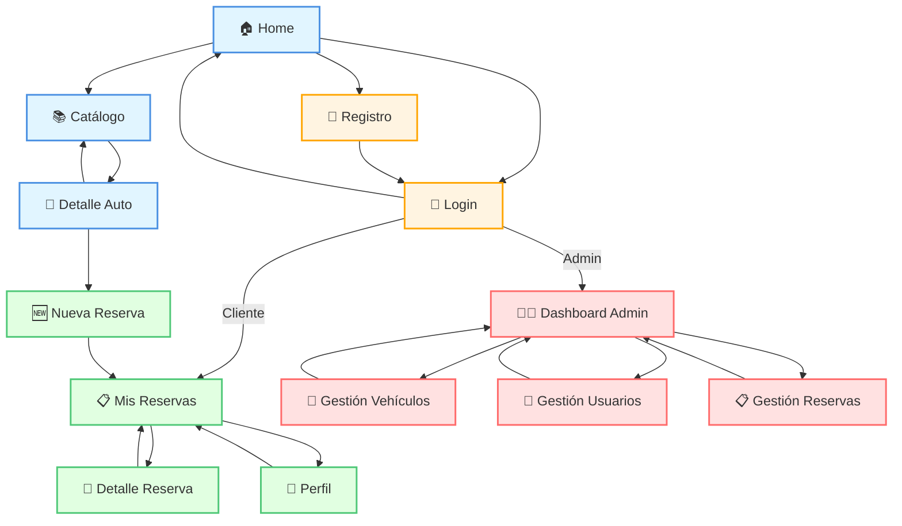
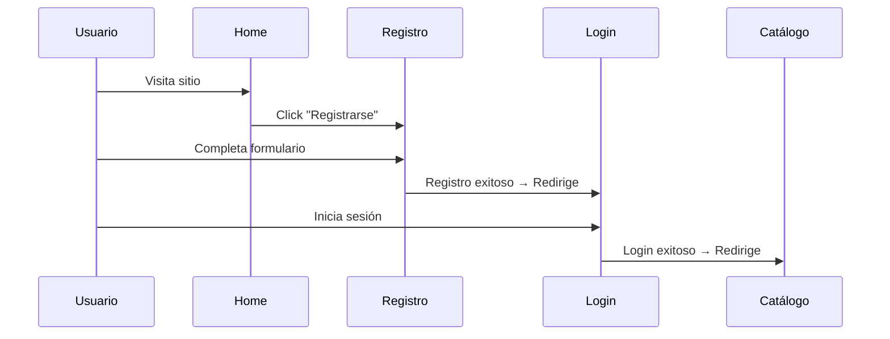
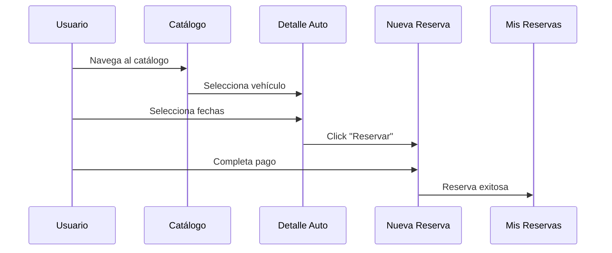
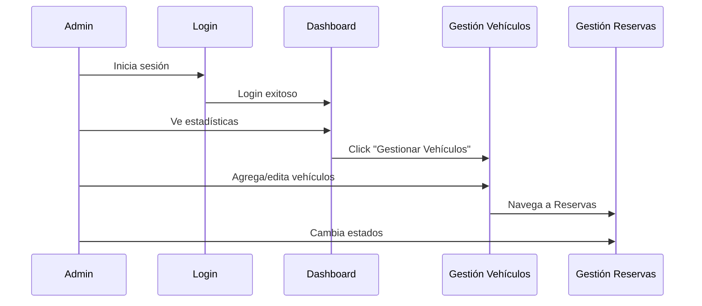

# 🗺️ Mapa de Navegación del Sistema RentaCar

Este documento muestra el flujo completo de navegación entre todas las páginas del sistema.

## 📊 Diagrama de Navegación Global



## 🎯 Rutas del Sistema

### Páginas Públicas (Acceso sin autenticación)

| Página | Ruta | Descripción |
|--------|------|-------------|
| Home | `/` | Landing page principal |
| Login | `/login` | Inicio de sesión |
| Registro | `/register` | Registro de nuevos usuarios |
| Catálogo | `/catalogo` | Listado de vehículos |
| Detalle Auto | `/autos/[id]` | Información detallada de vehículo |

### Páginas de Usuario (Requiere autenticación)

| Página | Ruta | Descripción |
|--------|------|-------------|
| Mis Reservas | `/reservas` | Listado de reservas del usuario |
| Nueva Reserva | `/reservas/nueva` | Formulario de nueva reserva |
| Detalle Reserva | `/reservas/[id]` | Detalles y factura de reserva |
| Perfil | `/perfil` | Gestión del perfil de usuario |

### Páginas de Administrador (Requiere rol admin)

| Página | Ruta | Descripción |
|--------|------|-------------|
| Dashboard | `/dashboard` | Panel principal del administrador |
| Gestión Vehículos | `/dashboard/vehiculos` | CRUD de vehículos |
| Gestión Usuarios | `/dashboard/usuarios` | Administración de usuarios |
| Gestión Reservas | `/dashboard/reservas` | Administración de reservas |

## 🔐 Protección de Rutas

### Rutas Públicas
```javascript
// Accesibles sin autenticación
'/', '/login', '/register', '/catalogo', '/autos/[id]'
```

### Rutas Protegidas (Usuario Autenticado)
```javascript
// Redirige a /login si no hay token
'/reservas', '/reservas/nueva', '/reservas/[id]', '/perfil'

// Verificación en cada página:
useEffect(() => {
  const token = localStorage.getItem('token');
  if (!token) router.push('/login');
}, []);
```

### Rutas Protegidas (Solo Admin)
```javascript
// Redirige a / si no es admin
'/dashboard', '/dashboard/vehiculos', '/dashboard/usuarios', '/dashboard/reservas'

// Verificación en cada página:
useEffect(() => {
  const user = JSON.parse(localStorage.getItem('user'));
  if (!user || user.rol !== 'admin') router.push('/');
}, []);
```

## 🔄 Flujos de Usuario Comunes

### Flujo 1: Usuario Nuevo Registrándose


### Flujo 2: Usuario Haciendo una Reserva


### Flujo 3: Admin Gestionando el Sistema


## 🧭 Navegación por Header

El Header está presente en todas las páginas y cambia según el estado de autenticación:

### Usuario No Autenticado
```
[Logo] - [Catálogo] - [Login] - [Registro] - [🌓 Theme]
```

### Usuario Autenticado (Cliente)
```
[Logo] - [Catálogo] - [Mis Reservas] - [Perfil] - [Cerrar Sesión] - [🌓 Theme]
```

### Usuario Autenticado (Admin)
```
[Logo] - [Catálogo] - [Dashboard] - [Perfil] - [Cerrar Sesión] - [🌓 Theme]
```

## 📱 Jerarquía de Navegación

```
📁 RentaCar
├── 🌐 Público
│   ├── Home (/)
│   ├── Login (/login)
│   ├── Registro (/register)
│   └── Catálogo
│       ├── Lista (/catalogo)
│       └── Detalle (/autos/[id])
│
├── 👤 Usuario Autenticado
│   ├── Reservas
│   │   ├── Lista (/reservas)
│   │   ├── Nueva (/reservas/nueva)
│   │   └── Detalle (/reservas/[id])
│   └── Perfil (/perfil)
│
└── 👨‍💼 Administrador
    ├── Dashboard (/dashboard)
    ├── Vehículos (/dashboard/vehiculos)
    ├── Usuarios (/dashboard/usuarios)
    └── Reservas (/dashboard/reservas)
```

## 🔗 Enlaces Rápidos entre Páginas

### Desde Home
- → Login
- → Registro
- → Catálogo

### Desde Catálogo
- → Detalle Auto (cualquier vehículo)
- → Login (si no autenticado y quiere reservar)

### Desde Detalle Auto
- → Nueva Reserva (con datos pre-llenados)
- → Catálogo (volver)

### Desde Mis Reservas
- → Detalle Reserva (cualquier reserva)
- → Nueva Reserva (botón crear)
- → Catálogo (si no hay reservas)

### Desde Dashboard Admin
- → Gestión Vehículos
- → Gestión Usuarios
- → Gestión Reservas

## 🎨 Códigos de Color del Diagrama

- 🔵 **Azul claro**: Páginas públicas
- 🟡 **Amarillo**: Autenticación (Login/Registro)
- 🟢 **Verde**: Páginas de usuario cliente
- 🔴 **Rojo**: Páginas de administrador

## 📍 Breadcrumbs Típicos

### Usuario Cliente
```
Home > Catálogo > Detalle Auto > Nueva Reserva
Home > Mis Reservas > Detalle Reserva
Home > Perfil
```

### Administrador
```
Home > Dashboard
Dashboard > Gestión de Vehículos
Dashboard > Gestión de Usuarios
Dashboard > Gestión de Reservas
```
