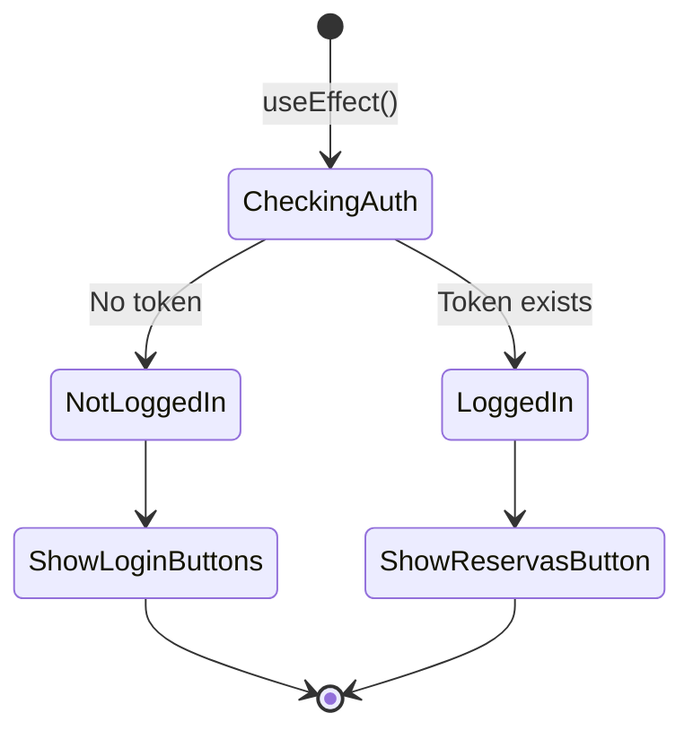

# 🏠 Wireframe: Home (Landing Page)

**Ruta:** `/`  
**Archivo:** `rentacar/front/files/src/app/page.js`  
**Acceso:** Público

## 📐 Estructura Visual

```mermaid
graph TB
    subgraph "Header Global"
        H1[Logo RentaCar]
        H2[Nav: Catálogo | Login/Registro | Perfil]
        H3[Theme Toggle]
    end
    
    subgraph "Hero Section"
        T1["<h1>RentaCar</h1>"]
        T2["Descripción: Tu plataforma de confianza<br/>para rentar autos..."]
        
        subgraph "Botones - Estado No Autenticado"
            B1[Iniciar Sesión]
            B2[Registrarse]
            B3[Ver Catálogo]
        end
        
        subgraph "Botones - Estado Autenticado"
            B4[Mis Reservas]
            B5[Ver Catálogo]
        end
    end
    
    subgraph "Features Section - 3 Columnas"
        F1["<h2>Amplio Catálogo</h2><br/>Vehículos de todas las categorías"]
        F2["<h2>Precios Competitivos</h2><br/>Tarifas accesibles con descuentos"]
        F3["<h2>Reservas Sencillas</h2><br/>Proceso rápido y confirmación inmediata"]
    end
    
    style T1 fill:#4a90e2,color:#fff
    style B1 fill:#50c878,color:#fff
    style B2 fill:#50c878,color:#fff
    style B3 fill:#4a90e2,color:#fff
    style B4 fill:#50c878,color:#fff
```

## 🎨 Componentes Principales

### 1. Hero Section
- **Título Principal:** "RentaCar"
- **Descripción:** Mensaje de bienvenida y propuesta de valor
- **Botones Dinámicos:**
  - Usuario NO autenticado: Iniciar Sesión, Registrarse, Ver Catálogo
  - Usuario autenticado: Mis Reservas, Ver Catálogo

### 2. Features Section
Presenta 3 características principales en formato de tarjetas:

| Feature | Título | Descripción |
|---------|--------|-------------|
| 1 | Amplio Catálogo | Vehículos de todas las categorías |
| 2 | Precios Competitivos | Tarifas accesibles con descuentos |
| 3 | Reservas Sencillas | Proceso rápido sin complicaciones |

## 🔄 Estados y Comportamiento

### Estado de Autenticación


### Interacciones
- ✅ Detección automática de estado de autenticación (localStorage)
- ✅ Escucha de cambios en el estado (storage event)
- ✅ Navegación a login/registro/catálogo/reservas

## 🎯 Elementos Clave

- **Responsive:** Diseño adaptable a móviles y desktop
- **Dynamic Content:** Botones cambian según autenticación
- **Call to Action:** Foco en "Ver Catálogo" como acción principal

## 📱 Layout Responsivo

```
Desktop (>768px):
┌─────────────────────────────────────┐
│  Header: Logo | Nav | Theme Toggle  │
├─────────────────────────────────────┤
│                                     │
│         HERO - Centrado             │
│         Botones en fila             │
│                                     │
├─────────────────────────────────────┤
│  [Feature 1] [Feature 2] [Feature 3]│
└─────────────────────────────────────┘

Mobile (<768px):
┌──────────────┐
│   Header     │
├──────────────┤
│     HERO     │
│   Botones    │
│   (stack)    │
├──────────────┤
│  Feature 1   │
│  Feature 2   │
│  Feature 3   │
└──────────────┘
```

## 🔗 Navegación desde esta página

- **Login** → `/login`
- **Registro** → `/register`
- **Catálogo** → `/catalogo`
- **Mis Reservas** → `/reservas` (requiere auth)
