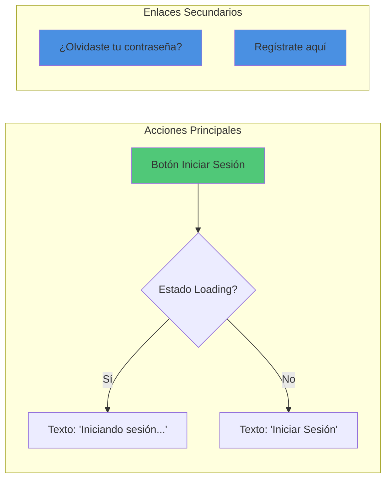
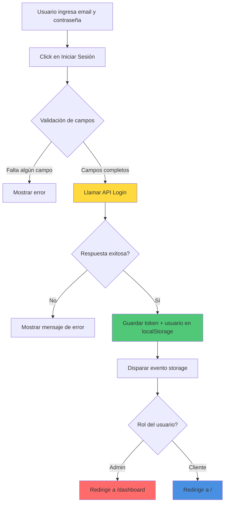

# 🔐 Wireframe: Login

**Ruta:** `/login`  
**Archivo:** `rentacar/front/files/src/app/login/page.js`  
**Acceso:** Público

## 📐 Estructura Visual

```mermaid
graph TB
    subgraph "Header Global"
        H[Logo + Navigation]
    end
    
    subgraph "Login Container - Centrado"
        T["<h1>Iniciar Sesión</h1>"]
        
        E[Alert Error - Condicional]
        
        subgraph "Formulario"
            F1["📧 Email<br/><input placeholder='ejemplo@correo.com'>"]
            F2["🔒 Contraseña<br/><input type='password'>"]
            F3["¿Olvidaste tu contraseña? (link)"]
        end
        
        B["[Botón] Iniciar Sesión / Iniciando sesión..."]
        
        R["¿No tienes cuenta? Regístrate aquí (link)"]
    end
    
    style T fill:#4a90e2,color:#fff
    style E fill:#ff6b6b,color:#fff
    style B fill:#50c878,color:#fff
    style R fill:#f0f0f0
```



## 🎨 Elementos del Formulario

### Campos de Entrada

| Campo | Tipo | Placeholder | Validación |
|-------|------|-------------|------------|
| Email | email | ejemplo@correo.com | Required, formato email |
| Contraseña | password | Tu contraseña | Required |

### Botones y Enlaces



## 🔄 Flujo de Login



## 📊 Estados de la Página

### Estado 1: Inicial
- Formulario vacío
- Botón habilitado
- Sin mensajes de error

### Estado 2: Loading
- Inputs deshabilitados
- Botón muestra "Iniciando sesión..."
- Botón deshabilitado

### Estado 3: Error
- Alerta roja visible con mensaje de error
- Formulario habilitado nuevamente
- Campos mantienen valores ingresados

### Estado 4: Éxito
- Datos guardados en localStorage
- Redirección automática

## 💾 Interacción con LocalStorage

```javascript
// Datos guardados al login exitoso:
localStorage.setItem('token', response.data.token)
localStorage.setItem('user', JSON.stringify(userData))

// Estructura de userData:
{
  id: number,
  nombre: string,
  apellido: string,
  email: string,
  rol: 'admin' | 'cliente',
  telefono?: string
}
```

## 🎯 Validaciones

### Client-side
- ✅ Email: formato válido
- ✅ Contraseña: campo no vacío
- ✅ Ambos campos requeridos

### Server-side
- ✅ Credenciales válidas
- ✅ Usuario existe
- ✅ Contraseña correcta
- ✅ Token válido en respuesta

## 📱 Layout Responsivo

```
Desktop:
┌────────────────────────────┐
│         Header             │
├────────────────────────────┤
│                            │
│   ┌──────────────────┐     │
│   │  Iniciar Sesión  │     │
│   │                  │     │
│   │  📧 Email        │     │
│   │  🔒 Contraseña   │     │
│   │                  │     │
│   │ [Iniciar Sesión] │     │
│   │                  │     │
│   │ ¿No tienes cuenta?│    │
│   └──────────────────┘     │
│                            │
└────────────────────────────┘

Mobile: Similar pero con ancho 100%
```

## 🔗 Navegación

- **Registro** → `/register`
- **Recuperar contraseña** → `/recuperar-contrasena`
- **Después del login (admin)** → `/dashboard`
- **Después del login (cliente)** → `/`
