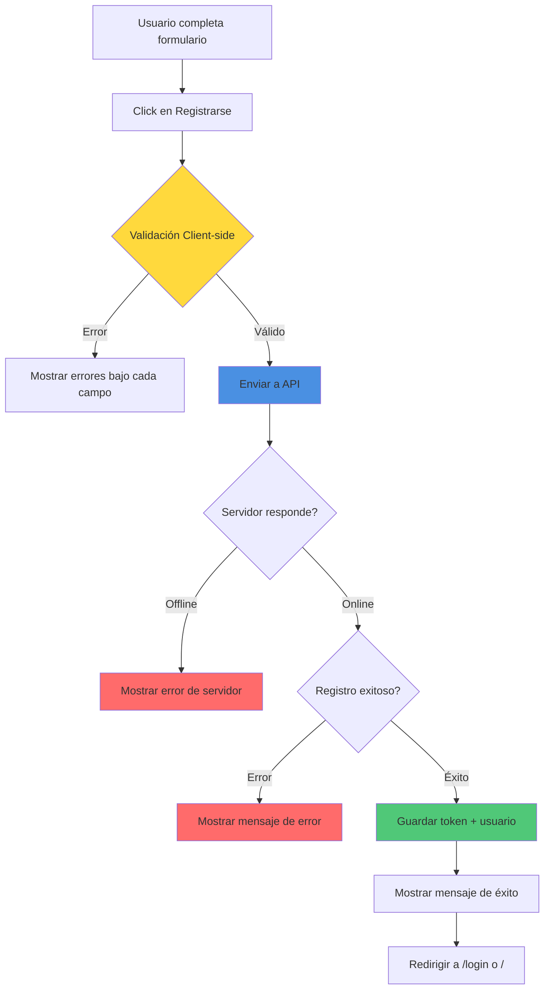
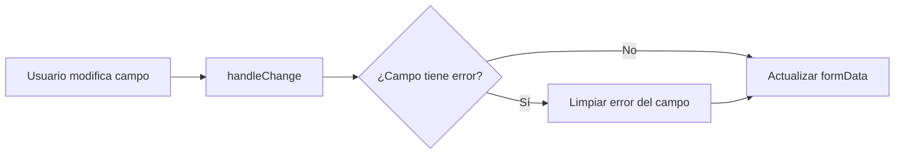
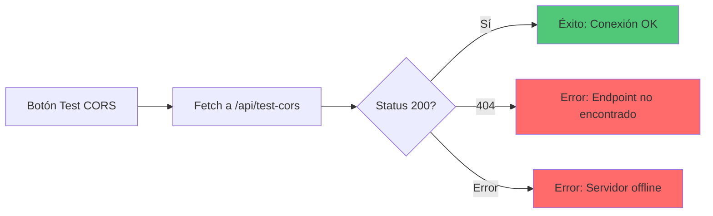

# 📝 Wireframe: Registro

**Ruta:** `/register`  
**Archivo:** `rentacar/front/files/src/app/register/page.js`  
**Acceso:** Público

## 📐 Estructura Visual

```mermaid
graph TB
    subgraph "Header Global"
        H[Logo + Navigation]
    end
    
    subgraph "Register Container"
        T["<h1>Crear Cuenta</h1>"]
        
        SE[Alert Error Servidor - Condicional]
        SS[Alert Éxito - Condicional]
        SO[Alert Server Offline - Condicional]
        
        subgraph "Formulario - Grid 2 columnas"
            F1["Nombre * <input>"]
            F2["Apellido * <input>"]
            F3["Email * <input type='email'>"]
            F4["Teléfono <input>"]
            F5["Tipo Documento <select>"]
            F6["Número Documento * <input>"]
            F7["Contraseña * <input type='password'>"]
            F8["Confirmar Contraseña * <input type='password'>"]
            F9["☑ Acepto términos y condiciones *"]
        end
        
        FE[Errores de validación por campo]
        
        B["[Botón] Registrarse / Registrando..."]
        BT["[Botón Debug] Test CORS"]
        
        L["¿Ya tienes cuenta? Inicia sesión aquí"]
    end
    
    style T fill:#4a90e2,color:#fff
    style SE fill:#ff6b6b,color:#fff
    style SS fill:#50c878,color:#fff
    style SO fill:#ffd93d
    style B fill:#50c878,color:#fff
```



## 🎨 Campos del Formulario

### Datos Personales

| Campo | Tipo | Requerido | Validación |
|-------|------|-----------|------------|
| Nombre | text | ✅ Sí | No vacío |
| Apellido | text | ✅ Sí | No vacío |
| Email | email | ✅ Sí | Formato email válido |
| Teléfono | tel | ❌ No | 10 dígitos (si se completa) |

### Documentación

| Campo | Tipo | Requerido | Opciones |
|-------|------|-----------|----------|
| Tipo Documento | select | ✅ Sí | DNI (default) |
| Número Documento | text | ✅ Sí | No vacío |

### Seguridad

| Campo | Tipo | Requerido | Validación |
|-------|------|-----------|------------|
| Contraseña | password | ✅ Sí | Mínimo 6 caracteres |
| Confirmar Contraseña | password | ✅ Sí | Debe coincidir con contraseña |
| Acepta Términos | checkbox | ✅ Sí | Debe estar marcado |

## 🔄 Flujo de Registro



## 📋 Validaciones Detalladas

### Validación en Tiempo Real


### Validaciones por Campo

```javascript
// Nombre y Apellido
if (!formData.nombre.trim()) → Error: "El nombre es requerido"
if (!formData.apellido.trim()) → Error: "El apellido es requerido"

// Email
if (!formData.email.trim()) → Error: "El email es requerido"
if (email && !emailRegex.test()) → Error: "Ingrese un email válido"

// Contraseña
if (!formData.contraseña) → Error: "La contraseña es requerida"
if (contraseña.length < 6) → Error: "Mínimo 6 caracteres"
if (contraseña !== confirmarContraseña) → Error: "Las contraseñas no coinciden"

// Teléfono (opcional)
if (telefono && !phoneRegex.test()) → Error: "Número inválido (10 dígitos)"

// Documento
if (!formData.numeroDocumento.trim()) → Error: "Número de documento requerido"

// Términos
if (!formData.aceptaTerminos) → Error: "Debe aceptar los términos"
```

## 🎯 Estados de la Página

### Estado 1: Inicial
- ✅ Formulario vacío
- ✅ Todos los campos habilitados
- ✅ Sin mensajes de error
- ✅ Estado del servidor: "unknown"

### Estado 2: Verificando Servidor
- ⏳ Check inicial de conexión con backend
- ⚠️ Si está offline: Mostrar advertencia

### Estado 3: Formulario con Errores
- ❌ Errores mostrados bajo cada campo problemático
- 🟡 Campos con error resaltados en rojo
- ✅ Usuario puede corregir

### Estado 4: Enviando
- ⏳ Loading spinner
- 🚫 Botón deshabilitado: "Registrando..."
- 🚫 Campos deshabilitados

### Estado 5: Éxito
- ✅ Mensaje de éxito verde
- ✅ Datos guardados en localStorage
- ➡️ Redirección automática

### Estado 6: Error del Servidor
- ❌ Mensaje de error en alerta roja
- ✅ Formulario habilitado para reintentar
- ℹ️ Detalles del error mostrados

## 🔧 Funcionalidades Especiales

### Test CORS (Debug Mode)


### Check Server Status (useEffect)
- ✅ Se ejecuta al montar componente
- ✅ Intenta conectar con http://localhost:5001
- ✅ Actualiza estado del servidor

## 📱 Layout Responsivo

```
Desktop (Grid 2 columnas):
┌────────────────────────────────┐
│          Header                │
├────────────────────────────────┤
│     Crear Cuenta               │
│  [Alert si hay error]          │
│                                │
│  Nombre        │  Apellido     │
│  Email         │  Teléfono     │
│  Tipo Doc      │  Nº Doc       │
│  Contraseña    │  Confirmar    │
│                                │
│  ☑ Acepto términos             │
│                                │
│  [Registrarse]  [Test CORS]    │
│                                │
│  ¿Ya tienes cuenta? →          │
└────────────────────────────────┘

Mobile (Stack):
┌──────────────┐
│   Header     │
├──────────────┤
│ Crear Cuenta │
│ [Alerts]     │
│ Nombre       │
│ Apellido     │
│ Email        │
│ Teléfono     │
│ Tipo Doc     │
│ Nº Doc       │
│ Contraseña   │
│ Confirmar    │
│ ☑ Términos   │
│ [Registrar]  │
│ ¿Ya tienes?  │
└──────────────┘
```

## 🔗 Navegación

- **Login** → `/login`
- **Términos y Condiciones** → `/terminos-y-condiciones`
- **Política de Privacidad** → `/politica-de-privacidad`
- **Después del registro exitoso** → `/login` o `/`

## 💾 Datos Guardados en Registro Exitoso

```javascript
localStorage.setItem('token', response.data.token)
localStorage.setItem('user', JSON.stringify({
  id, nombre, apellido, email, telefono, 
  tipoDocumento, numeroDocumento, rol
}))
```
