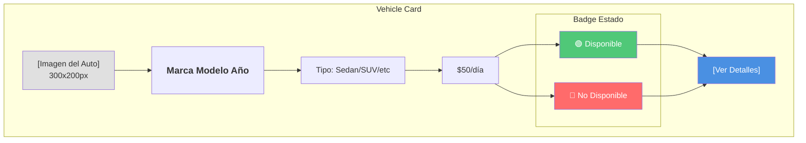
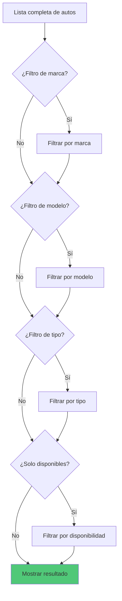
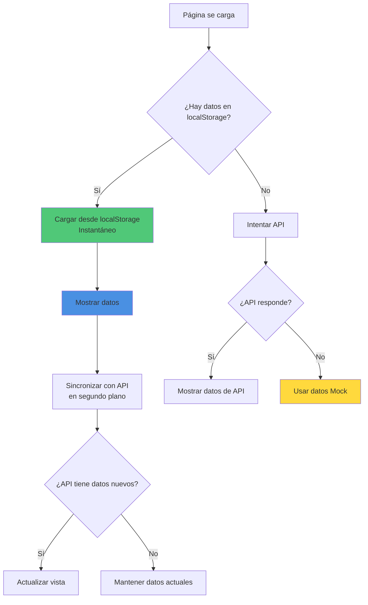

# 🚗 Wireframe: Catálogo de Vehículos

**Ruta:** `/catalogo`  
**Archivo:** `rentacar/front/files/src/app/catalogo/page.js`  
**Acceso:** Público

## 📐 Estructura Visual

```mermaid
graph TB
    subgraph "Header Global"
        H[Logo + Navigation]
    end
    
    subgraph "Catálogo Container"
        T["<h1>Catálogo de Vehículos</h1>"]
        
        subgraph "Filtros - Horizontal"
            F1["Marca <select>"]
            F2["Modelo <select>"]
            F3["Tipo <select>"]
            F4["☑ Solo Disponibles"]
            FB["[Limpiar Filtros]"]
        end
        
        L[Loading Spinner - Condicional]
        E[Alert Error - Condicional]
        
        subgraph "Grid de Vehículos - 3 columnas"
            V1[Card Vehículo 1]
            V2[Card Vehículo 2]
            V3[Card Vehículo 3]
            V4[Card Vehículo 4]
            V5[Card Vehículo 5]
            V6[Card Vehículo 6]
        end
        
        NR["Sin resultados - Mensaje cuando filtros no encuentran nada"]
    end
    
    style T fill:#4a90e2,color:#fff
    style FB fill:#ff6b6b,color:#fff
    style L fill:#ffd93d
    style E fill:#ff6b6b,color:#fff
```



## 🎴 Card de Vehículo (Detalle)



## 🎯 Sistema de Filtros

### Estructura de Filtros

| Filtro | Tipo | Opciones | Función |
|--------|------|----------|---------|
| Marca | select | "Todas", Toyota, Honda, Ford, etc. | Filtra por marca |
| Modelo | select | "Todos", depende de marca | Filtra por modelo específico |
| Tipo | select | "Todos", Sedan, SUV, Compacto, etc. | Filtra por tipo |
| Solo Disponibles | checkbox | true/false | Muestra solo disponibles |

### Lógica de Filtrado



## 📊 Estrategia de Carga de Datos



### Datos Mock (Fallback)

```javascript
// 6 vehículos de ejemplo con:
- Toyota Corolla 2023 ($50/día)
- Honda Civic 2022 ($45/día)
- Ford Explorer 2023 SUV ($75/día)
- Chevrolet Spark 2021 ($35/día)
- BMW X5 2023 SUV ($120/día)
- Mercedes-Benz CLA 2022 ($100/día)
```

## 🔄 Estados de la Página

### Estado 1: Loading
```
┌────────────────┐
│   Catálogo     │
│   [Filtros]    │
│                │
│   ⏳ Cargando  │
│   vehículos... │
└────────────────┘
```

### Estado 2: Con Datos
```
┌────────────────────────────────┐
│         Catálogo               │
│    [Filtros activos]           │
│                                │
│  [Auto1]  [Auto2]  [Auto3]     │
│  [Auto4]  [Auto5]  [Auto6]     │
└────────────────────────────────┘
```

### Estado 3: Sin Resultados
```
┌────────────────┐
│   Catálogo     │
│   [Filtros]    │
│                │
│  ❌ No se      │
│  encontraron   │
│  vehículos     │
│                │
│ [Limpiar]      │
└────────────────┘
```

### Estado 4: Error
```
┌────────────────┐
│   Catálogo     │
│                │
│  ⚠️ Error al   │
│  cargar el     │
│  catálogo      │
│                │
│  [Reintentar]  │
└────────────────┘
```

## 📱 Layout Responsivo

### Desktop (Grid 3 columnas)
```
┌──────────────────────────────────────┐
│            Catálogo                  │
│  [Marca] [Modelo] [Tipo] ☑ Disp.    │
├──────────────────────────────────────┤
│                                      │
│  ┌────┐  ┌────┐  ┌────┐             │
│  │ V1 │  │ V2 │  │ V3 │             │
│  └────┘  └────┘  └────┘             │
│                                      │
│  ┌────┐  ┌────┐  ┌────┐             │
│  │ V4 │  │ V5 │  │ V6 │             │
│  └────┘  └────┘  └────┘             │
│                                      │
└──────────────────────────────────────┘
```

### Tablet (Grid 2 columnas)
```
┌────────────────────────┐
│      Catálogo          │
│  [Filtros en 2 filas]  │
├────────────────────────┤
│  ┌────┐    ┌────┐      │
│  │ V1 │    │ V2 │      │
│  └────┘    └────┘      │
│  ┌────┐    ┌────┐      │
│  │ V3 │    │ V4 │      │
│  └────┘    └────┘      │
└────────────────────────┘
```

### Mobile (Stack)
```
┌──────────┐
│ Catálogo │
│ [Filtro] │
│ [Filtro] │
│ [Filtro] │
├──────────┤
│  ┌────┐  │
│  │ V1 │  │
│  └────┘  │
│  ┌────┐  │
│  │ V2 │  │
│  └────┘  │
│  ┌────┐  │
│  │ V3 │  │
│  └────┘  │
└──────────┘
```

## 🎨 Elementos Interactivos

### Card Hover Effect
```css
/* Al pasar el mouse */
- Sombra más pronunciada
- Leve elevación (transform: translateY(-4px))
- Border color cambia
```

### Botón "Ver Detalles"
```mermaid
graph LR
    A[Click Ver Detalles] --> B[Navegación a /autos/[id]]
    B --> C[Carga página de detalle]
    
    style A fill:#4a90e2
    style C fill:#50c878
```

## 💾 Gestión de Datos

### LocalStorage Keys
```javascript
'rentacar_autos' → Array de vehículos completo
```

### Sincronización
- ✅ Carga inmediata desde localStorage
- ✅ Actualización en segundo plano desde API
- ✅ Fallback a datos mock si todo falla

## 🔗 Navegación

- **Ver detalles de auto** → `/autos/[id]`
- **Login** (si usuario quiere reservar) → `/login`

## 📈 Optimizaciones

1. **Carga rápida:** localStorage primero
2. **UX mejorada:** Datos mock como último recurso
3. **Sincronización:** API en segundo plano
4. **Filtros reactivos:** Actualización instantánea
5. **Imágenes:** Lazy loading implementado
