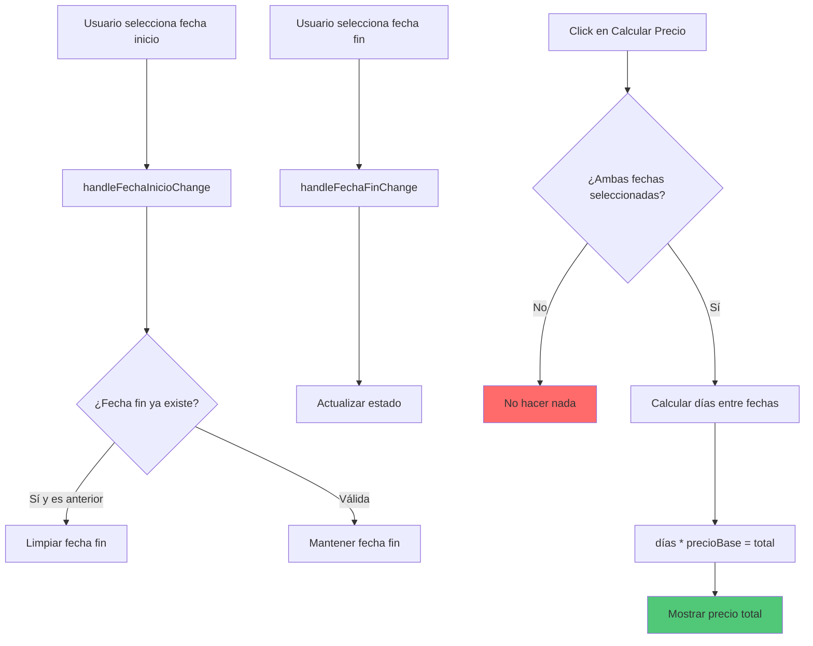
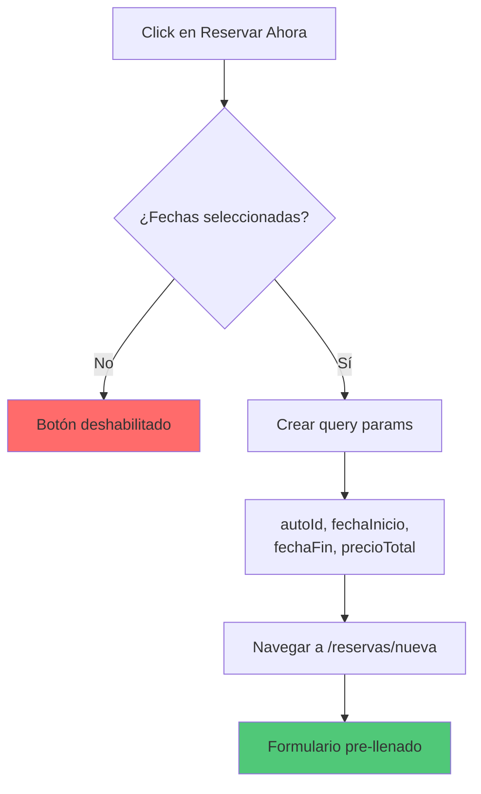
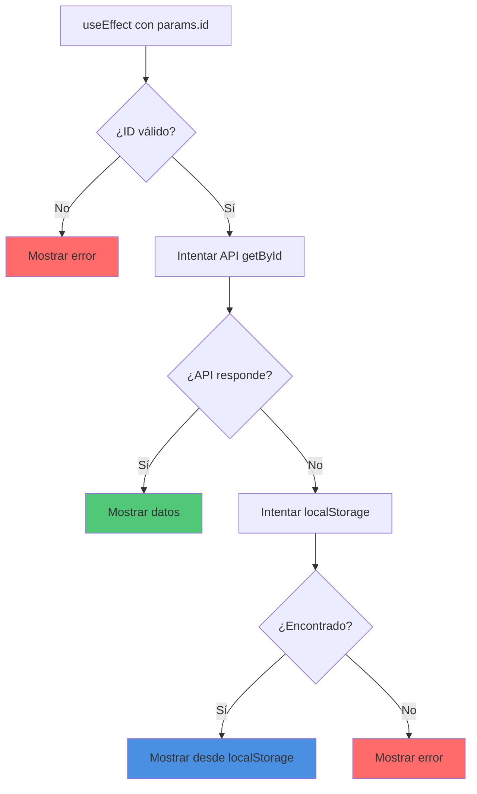

# 🚙 Wireframe: Detalle de Auto

**Ruta:** `/autos/[id]`  
**Archivo:** `rentacar/front/files/src/app/autos/[id]/page.js`  
**Acceso:** Público

## 📐 Estructura Visual

```mermaid
graph TB
    subgraph "Header Global"
        H[Logo + Navigation]
    end
    
    subgraph "Auto Detalle Container"
        L[Loading Spinner - Condicional]
        E[Alert Error - Condicional]
        
        subgraph "Detalle - Layout 2 columnas"
            subgraph "Columna Izquierda"
                IMG["[Imagen Grande del Auto]<br/>600x400px"]
                SPECS["📋 Especificaciones:<br/>- Marca<br/>- Modelo<br/>- Año<br/>- Tipo<br/>- Color<br/>- Matrícula"]
            end
            
            subgraph "Columna Derecha"
                INFO["<h1>Marca Modelo Año</h1>"]
                PRICE["<h2>$XX/día</h2>"]
                STATUS["🟢 Disponible / 🔴 No Disponible"]
                
                subgraph "Calculadora de Reserva"
                    FI["📅 Fecha Inicio<br/><input type='date'>"]
                    FF["📅 Fecha Fin<br/><input type='date'>"]
                    BC["[Calcular Precio]"]
                    PT["💰 Precio Total: $XXX<br/>(X días)"]
                end
                
                BR["[Reservar Ahora]"]
                BB["[← Volver al Catálogo]"]
            end
        end
    end
    
    style IMG fill:#e0e0e0
    style INFO fill:#4a90e2,color:#fff
    style PRICE fill:#50c878,color:#fff
    style BR fill:#50c878,color:#fff
    style BC fill:#4a90e2,color:#fff
    style BB fill:#6c757d,color:#fff
```



## 🎨 Secciones Principales

### 1. Galería de Imagen
```
┌─────────────────────────┐
│                         │
│    [Imagen Principal]   │
│       600 x 400px       │
│                         │
│   (Puede incluir mini   │
│    thumbnails abajo)    │
└─────────────────────────┘
```

### 2. Información del Vehículo

| Campo | Ejemplo | Visualización |
|-------|---------|---------------|
| Marca | Toyota | Parte del título |
| Modelo | Corolla | Parte del título |
| Año | 2023 | Parte del título |
| Tipo | Sedan | Badge |
| Color | Blanco | Texto |
| Matrícula | ABC-123 | Texto |
| Precio Base | $50 | Destacado |
| Disponibilidad | Disponible | Badge verde/rojo |

### 3. Calculadora de Precio



## 🔄 Estados de la Página

### Estado 1: Loading
```
┌─────────────────┐
│                 │
│   ⏳ Cargando   │
│   detalles del  │
│   vehículo...   │
│                 │
└─────────────────┘
```

### Estado 2: Error
```
┌──────────────────┐
│   ❌ Error       │
│                  │
│  No se encontró  │
│  el vehículo     │
│                  │
│ [Volver Catálogo]│
└──────────────────┘
```

### Estado 3: Vehículo Cargado - Sin Fechas
```
┌─────────────────────────────────┐
│ [Imagen]    │  Toyota Corolla   │
│             │  $50/día          │
│ [Specs]     │  🟢 Disponible    │
│             │                   │
│             │  Fecha Inicio: __ │
│             │  Fecha Fin: __    │
│             │  [Calcular]       │
│             │  Precio: -        │
│             │  [Reservar]🚫     │
└─────────────────────────────────┘
```

### Estado 4: Calculando Precio
```
┌─────────────────────────────────┐
│ [Imagen]    │  Toyota Corolla   │
│             │  $50/día          │
│ [Specs]     │  🟢 Disponible    │
│             │                   │
│             │  Fecha Inicio: ✅ │
│             │  Fecha Fin: ✅    │
│             │  ⏳ Calculando... │
│             │  Precio: -        │
└─────────────────────────────────┘
```

### Estado 5: Precio Calculado
```
┌─────────────────────────────────┐
│ [Imagen]    │  Toyota Corolla   │
│             │  $50/día          │
│ [Specs]     │  🟢 Disponible    │
│             │                   │
│             │  Fecha: 10/03/26  │
│             │  Hasta: 15/03/26  │
│             │  [Calcular]       │
│             │  💰 $250 (5 días) │
│             │  [Reservar Ahora]✅│
└─────────────────────────────────┘
```

## 🎯 Funcionalidad del Botón Reservar



### Query Parameters
```javascript
/reservas/nueva?
  autoId=123&
  fechaInicio=2026-03-10T00:00:00.000Z&
  fechaFin=2026-03-15T00:00:00.000Z&
  precioTotal=250
```

## 📊 Estrategia de Carga de Datos



## 📱 Layout Responsivo

### Desktop (2 columnas)
```
┌────────────────────────────────────┐
│           Header                   │
├────────────────────────────────────┤
│                                    │
│  ┌──────────┐   ┌──────────────┐  │
│  │          │   │ Toyota       │  │
│  │  Imagen  │   │ Corolla 2023 │  │
│  │          │   │              │  │
│  │          │   │ $50/día      │  │
│  ├──────────┤   │ 🟢 Disponible│  │
│  │ Specs:   │   │              │  │
│  │ - Marca  │   │ Fecha Inicio │  │
│  │ - Modelo │   │ Fecha Fin    │  │
│  │ - Año    │   │ [Calcular]   │  │
│  │ - Tipo   │   │ Precio: $250 │  │
│  └──────────┘   │ [Reservar]   │  │
│                 │ [Volver]     │  │
│                 └──────────────┘  │
└────────────────────────────────────┘
```

### Mobile (Stack)
```
┌──────────────┐
│   Header     │
├──────────────┤
│  [Imagen]    │
│              │
│ Toyota Cor   │
│ $50/día      │
│ 🟢 Disponible│
│              │
│ Specs:       │
│ - Marca...   │
│              │
│ Fecha Inicio │
│ Fecha Fin    │
│ [Calcular]   │
│ Total: $250  │
│ [Reservar]   │
│ [Volver]     │
└──────────────┘
```

## 🔧 Validaciones

### Fechas
- ✅ Fecha inicio debe ser hoy o posterior
- ✅ Fecha fin debe ser posterior a fecha inicio
- ✅ Si se cambia fecha inicio y es posterior a fecha fin, limpiar fecha fin
- ✅ Ambas fechas requeridas para calcular

### Botón Reservar
- 🚫 Deshabilitado si no hay fechas
- 🚫 Deshabilitado si no hay precio calculado
- ✅ Habilitado solo cuando todo está completo

## 🔗 Navegación

- **Volver al catálogo** → `/catalogo`
- **Reservar** → `/reservas/nueva?params`
- **Login** (si no autenticado) → `/login`

## 💡 Mejoras UX

1. **Animación de cálculo:** Loading spinner al calcular
2. **Validación visual:** Fechas en rojo si inválidas
3. **Precio destacado:** Grande y verde cuando está calculado
4. **Breadcrumbs:** Catálogo > Detalle Auto
5. **Galería:** Múltiples imágenes si están disponibles
