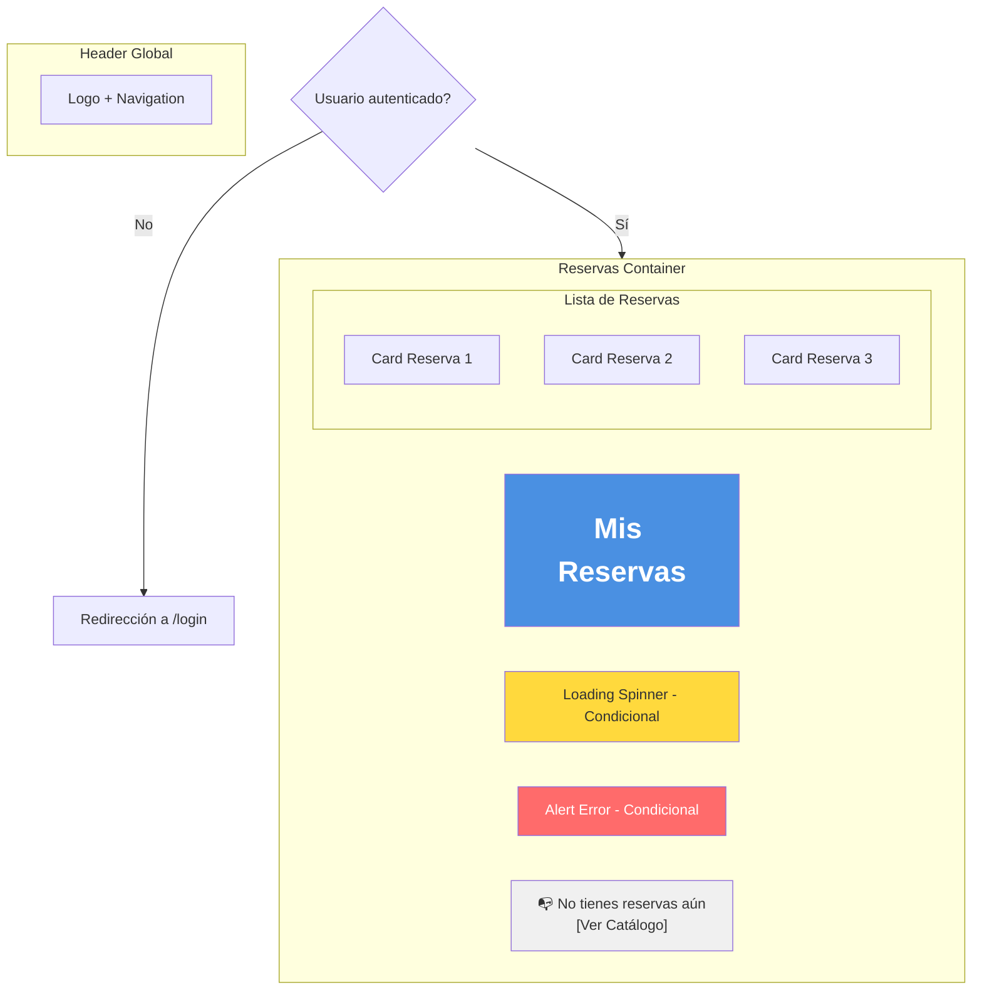
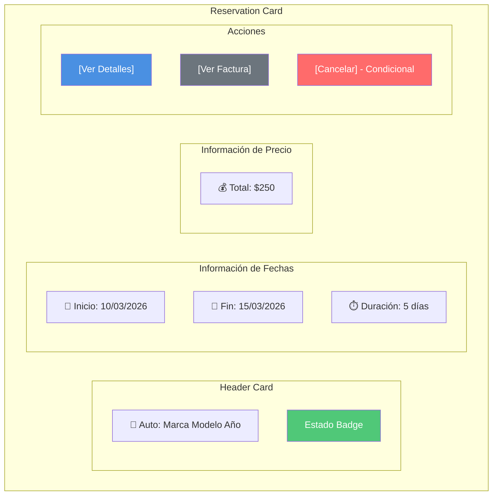
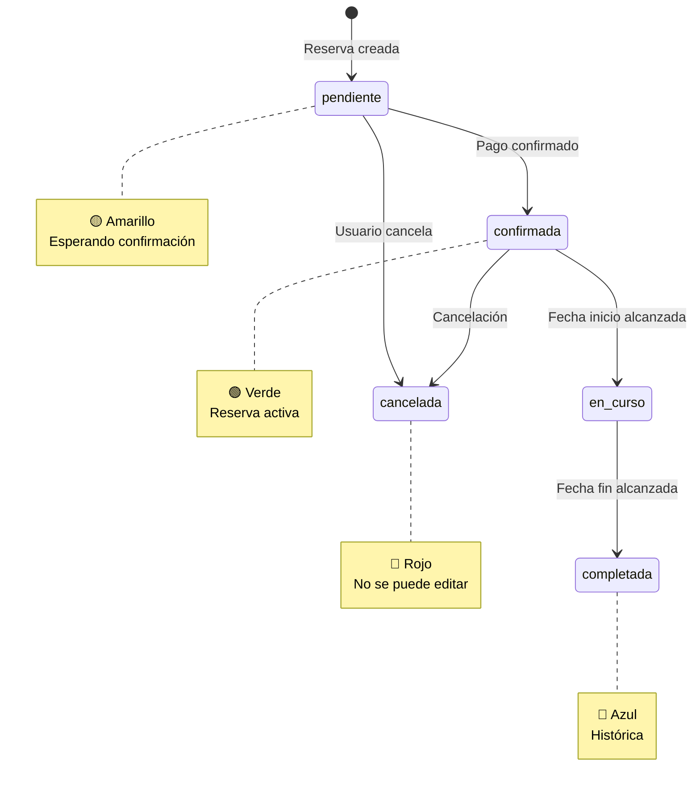
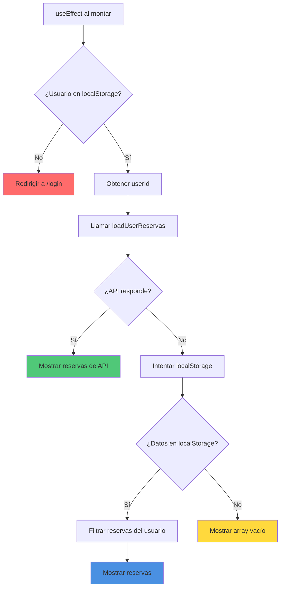
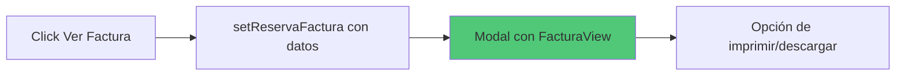
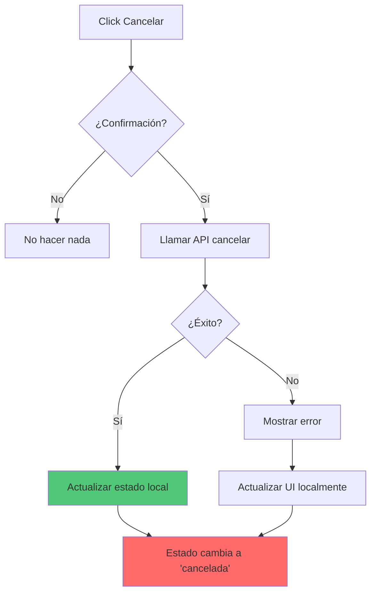
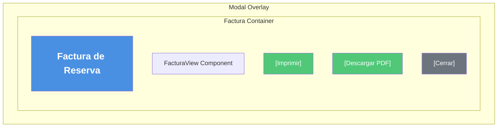

# 📋 Wireframe: Mis Reservas

**Ruta:** `/reservas`  
**Archivo:** `rentacar/front/files/src/app/reservas/page.js`  
**Acceso:** Requiere autenticación

## 📐 Estructura Visual



## 🎴 Card de Reserva (Detalle)



## 🏷️ Estados de Reserva



### Badges de Estado

| Estado | Color | Icono | Acciones Disponibles |
|--------|-------|-------|---------------------|
| pendiente | 🟡 Amarillo | ⏳ | Ver detalles, Cancelar |
| confirmada | 🟢 Verde | ✅ | Ver detalles, Ver factura, Cancelar |
| en_curso | 🔵 Azul | 🚗 | Ver detalles, Ver factura |
| completada | ⚫ Gris | ✔️ | Ver detalles, Ver factura |
| cancelada | 🔴 Rojo | ❌ | Ver detalles |

## 🔄 Flujo de Carga de Datos



## 🎯 Acciones sobre Reservas

### 1. Ver Detalles
```mermaid
graph LR
    A[Click Ver Detalles] --> B[Navegar a /reservas/[id]]
    B --> C[Mostrar página de detalle]
    
    style C fill:#4a90e2
```

### 2. Ver Factura


### 3. Cancelar Reserva


## 📊 Estados de la Página

### Estado 1: Loading
```
┌─────────────────┐
│  Mis Reservas   │
│                 │
│  ⏳ Cargando    │
│  reservas...    │
│                 │
└─────────────────┘
```

### Estado 2: Sin Reservas
```
┌─────────────────────┐
│   Mis Reservas      │
│                     │
│  📭 No tienes       │
│  reservas aún       │
│                     │
│  ¿Quieres rentar    │
│  un vehículo?       │
│                     │
│  [Ver Catálogo]     │
└─────────────────────┘
```

### Estado 3: Con Reservas
```
┌─────────────────────────────┐
│      Mis Reservas           │
├─────────────────────────────┤
│  ┌───────────────────────┐  │
│  │ 🚗 Toyota Corolla     │  │
│  │ Estado: 🟢 Confirmada │  │
│  │ 📅 10/03 - 15/03     │  │
│  │ 💰 Total: $250       │  │
│  │ [Detalles] [Factura] │  │
│  │ [❌ Cancelar]         │  │
│  └───────────────────────┘  │
│                             │
│  ┌───────────────────────┐  │
│  │ 🚗 Honda Civic        │  │
│  │ Estado: ⏳ Pendiente  │  │
│  │ 📅 20/03 - 25/03     │  │
│  │ 💰 Total: $200       │  │
│  │ [Detalles] [Cancelar]│  │
│  └───────────────────────┘  │
└─────────────────────────────┘
```

### Estado 4: Error
```
┌─────────────────────┐
│   Mis Reservas      │
│                     │
│  ⚠️ Error al        │
│  cargar reservas    │
│                     │
│  [Reintentar]       │
└─────────────────────┘
```

## 💾 Datos Mostrados por Reserva

### Información del Vehículo
```javascript
{
  autoId: number,
  auto: {
    marca: string,
    modelo: string,
    anio: number,
    imagen?: string
  }
}
```

### Información de la Reserva
```javascript
{
  id: number,
  usuarioId: number,
  fechaInicio: Date,
  fechaFin: Date,
  precioTotal: number,
  estado: 'pendiente' | 'confirmada' | 'en_curso' | 'completada' | 'cancelada',
  metodoPago?: string,
  createdAt: Date
}
```

## 📱 Layout Responsivo

### Desktop
```
┌──────────────────────────────┐
│       Mis Reservas           │
├──────────────────────────────┤
│                              │
│  ┌────────────────────────┐  │
│  │  Reserva 1             │  │
│  │  [Layout horizontal]   │  │
│  └────────────────────────┘  │
│                              │
│  ┌────────────────────────┐  │
│  │  Reserva 2             │  │
│  └────────────────────────┘  │
│                              │
└──────────────────────────────┘
```

### Mobile (Stack)
```
┌──────────────┐
│ Mis Reservas │
├──────────────┤
│ ┌──────────┐ │
│ │ Reserva 1│ │
│ │ [Stack]  │ │
│ │ Info     │ │
│ │ Botones  │ │
│ └──────────┘ │
│              │
│ ┌──────────┐ │
│ │ Reserva 2│ │
│ └──────────┘ │
└──────────────┘
```

## 🎨 Modal de Factura



## 🔗 Navegación

- **Ver Catálogo** → `/catalogo`
- **Ver Detalles de Reserva** → `/reservas/[id]`
- **Nueva Reserva** → `/catalogo` → seleccionar auto → `/reservas/nueva`

## 📅 Formato de Fechas

```javascript
// Función formatDate
const formatDate = (dateString) => {
  const date = new Date(dateString);
  return date.toLocaleDateString('es-ES', {
    year: 'numeric',
    month: 'long',
    day: 'numeric'
  });
}

// Ejemplo: "10 de marzo de 2026"
```

## ⚡ Optimizaciones

1. **Carga inicial:** LocalStorage + API
2. **Filtrado:** Solo reservas del usuario actual
3. **Estado en tiempo real:** Escucha eventos de actualización
4. **Cache:** localStorage para modo offline
