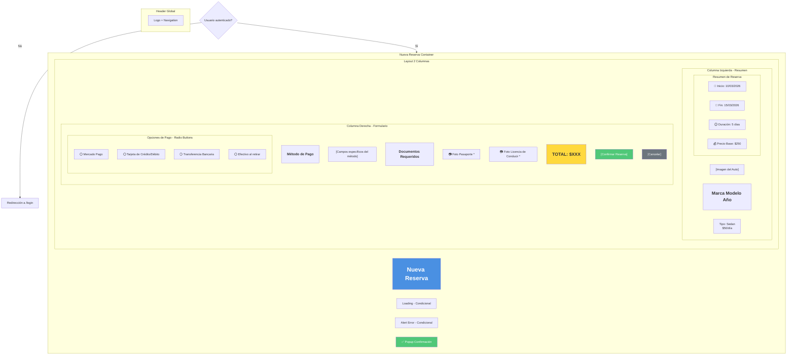
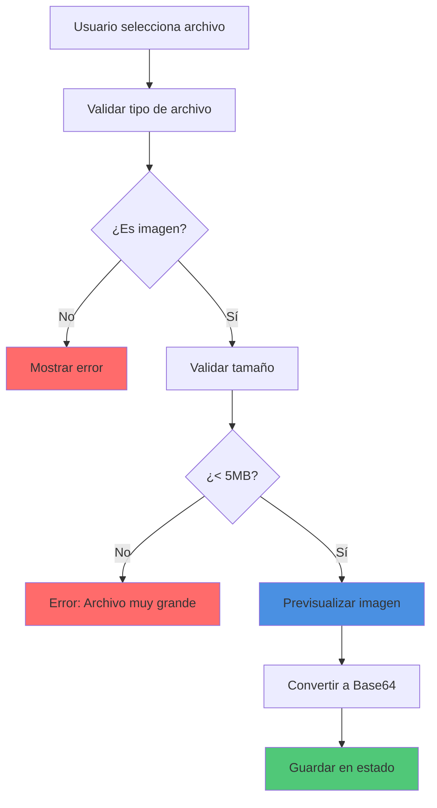
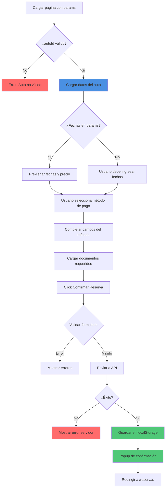

# 🆕 Wireframe: Nueva Reserva

**Ruta:** `/reservas/nueva`  
**Archivo:** `rentacar/front/files/src/app/reservas/nueva/page.js`  
**Acceso:** Requiere autenticación

## 📐 Estructura Visual



## 💳 Métodos de Pago Disponibles

### 1. Mercado Pago
```
┌───────────────────────────┐
│ ⚫ Mercado Pago            │
│                           │
│ Paga de forma segura con  │
│ tu cuenta de Mercado Pago │
│                           │
│ Campos requeridos:        │
│ • Email                   │
│ • Foto Pasaporte *        │
│ • Foto Licencia *         │
└───────────────────────────┘
```

### 2. Tarjeta de Crédito/Débito
```
┌───────────────────────────┐
│ ⚫ Tarjeta Créd/Déb       │
│                           │
│ Visa, Mastercard, Amex... │
│                           │
│ Campos requeridos:        │
│ • Tipo de Tarjeta         │
│ • Últimos 4 dígitos       │
│ • Foto Pasaporte *        │
│ • Foto Licencia *         │
│                           │
│ Nota: No se almacena      │
│ información completa      │
└───────────────────────────┘
```

### 3. Transferencia Bancaria
```
┌───────────────────────────┐
│ ⚫ Transferencia Bancaria  │
│                           │
│ Realiza transferencia a   │
│ nuestra cuenta bancaria   │
│                           │
│ Campos requeridos:        │
│ • Nombre del Titular      │
│ • Email Confirmación      │
│ • Comprobante de Pago     │
│ • Foto Pasaporte *        │
│ • Foto Licencia *         │
└───────────────────────────┘
```

### 4. Efectivo al Retirar
```
┌───────────────────────────┐
│ ⚫ Efectivo al retirar     │
│                           │
│ Pago en efectivo al       │
│ momento de retirar        │
│                           │
│ Campos requeridos:        │
│ • Foto Pasaporte *        │
│ • Foto Licencia *         │
│                           │
│ El monto total se debe    │
│ pagar antes de retirar    │
└───────────────────────────┘
```

## 📸 Sistema de Carga de Documentos



### Campos de Documentos

| Documento | Requerido | Formatos | Tamaño Máx |
|-----------|-----------|----------|------------|
| Pasaporte | ✅ Sí | JPG, PNG, PDF | 5MB |
| Licencia | ✅ Sí | JPG, PNG, PDF | 5MB |
| Comprobante | Condicional | JPG, PNG, PDF | 5MB |

## 🔄 Flujo Completo de Reserva



## 📊 Estados de la Página

### Estado 1: Loading
```
┌─────────────────┐
│ Nueva Reserva   │
│                 │
│  ⏳ Cargando    │
│  formulario...  │
│                 │
└─────────────────┘
```

### Estado 2: Sin Método Seleccionado
```
┌────────────────────────────────┐
│ [Auto]     │ Método de Pago    │
│ [Info]     │ ⚪ Mercado Pago    │
│            │ ⚪ Tarjeta         │
│ Resumen:   │ ⚪ Transferencia   │
│ 10-15 mar  │ ⚪ Efectivo        │
│ $250       │                   │
│            │ [Campos vacíos]   │
│            │                   │
│            │ [Confirmar]🚫     │
└────────────────────────────────┘
```

### Estado 3: Método Seleccionado
```
┌────────────────────────────────┐
│ [Auto]     │ Método de Pago    │
│ [Info]     │ ⚫ Mercado Pago    │
│            │ ⚪ Tarjeta         │
│ Resumen:   │                   │
│ 10-15 mar  │ Email: ______     │
│ $250       │                   │
│            │ Documentos:       │
│            │ 📷 Pasaporte __   │
│            │ 📷 Licencia __    │
│            │                   │
│            │ TOTAL: $250       │
│            │ [Confirmar]🚫     │
└────────────────────────────────┘
```

### Estado 4: Formulario Completo
```
┌────────────────────────────────┐
│ [Auto]     │ Método de Pago    │
│ [Info]     │ ⚫ Mercado Pago    │
│            │                   │
│ Resumen:   │ Email: ✅         │
│ 10-15 mar  │                   │
│ $250       │ Documentos:       │
│            │ 📷 Pasaporte ✅   │
│            │ 📷 Licencia ✅    │
│            │                   │
│            │ TOTAL: $250       │
│            │ [Confirmar]✅     │
└────────────────────────────────┘
```

### Estado 5: Enviando
```
┌────────────────────────────────┐
│            │                   │
│            │  ⏳ Procesando    │
│            │  tu reserva...    │
│            │                   │
│            │  Por favor        │
│            │  espera...        │
│            │                   │
└────────────────────────────────┘
```

### Estado 6: Confirmación Exitosa
```
┌─────────────────────────────┐
│  ✅ ¡Reserva Confirmada!    │
│                             │
│  Tu reserva ha sido         │
│  registrada exitosamente    │
│                             │
│  ID: #12345                 │
│                             │
│  [Ver Mis Reservas]         │
│  [Descargar Factura]        │
└─────────────────────────────┘
```

## 🎯 Validaciones del Formulario

### Validaciones Globales
```javascript
✅ autoId debe existir
✅ fechaInicio y fechaFin deben estar definidas
✅ Método de pago debe estar seleccionado
✅ Todos los campos del método deben estar completos
✅ Documentos requeridos deben estar cargados
```

### Validaciones por Método de Pago

| Método | Validación |
|--------|-----------|
| Mercado Pago | Email válido + documentos |
| Tarjeta | Tipo + últimos 4 dígitos + documentos |
| Transferencia | Nombre + email + comprobante + documentos |
| Efectivo | Solo documentos |

## 📱 Layout Responsivo

### Desktop (2 columnas)
```
┌────────────────────────────────────┐
│          Nueva Reserva             │
├────────────────────────────────────┤
│                                    │
│  ┌──────────┐  ┌───────────────┐  │
│  │  Auto    │  │ Método Pago   │  │
│  │  Imagen  │  │               │  │
│  │          │  │ [Opciones]    │  │
│  │ Resumen  │  │               │  │
│  │ Fechas   │  │ [Campos]      │  │
│  │ Precio   │  │               │  │
│  │          │  │ Documentos    │  │
│  │          │  │               │  │
│  │          │  │ TOTAL: $XXX   │  │
│  │          │  │ [Confirmar]   │  │
│  └──────────┘  └───────────────┘  │
└────────────────────────────────────┘
```

### Mobile (Stack)
```
┌──────────────┐
│Nueva Reserva │
├──────────────┤
│ [Auto Img]   │
│ Toyota Cor.  │
│ $50/día      │
│              │
│ Resumen:     │
│ 10-15 mar    │
│ Total: $250  │
├──────────────┤
│ Método Pago  │
│ ⚪ MP        │
│ ⚪ Tarjeta   │
│ ⚪ Transfer  │
│ ⚪ Efectivo  │
│              │
│ [Campos]     │
│              │
│ Documentos   │
│ 📷📷        │
│              │
│ [Confirmar]  │
└──────────────┘
```

## 🔗 Navegación

- **Cancelar** → Volver a `/catalogo` o `/autos/[id]`
- **Éxito** → `/reservas` (Mis Reservas)
- **Ver Factura** → Modal o `/reservas/[id]`

## 💾 Datos de la Reserva Creada

```javascript
{
  usuarioId: number,
  autoId: number,
  fechaInicio: Date,
  fechaFin: Date,
  precioTotal: number,
  metodoPago: string,
  datosPago: {
    // Específicos del método
  },
  documentos: {
    pasaporte: base64 | url,
    licencia: base64 | url,
    comprobante?: base64 | url
  },
  estado: 'pendiente',
  createdAt: Date
}
```

## ✨ Características Especiales

1. **Pre-llenado:** Usa query params de página anterior
2. **Validación en tiempo real:** Campos se validan al cambiar
3. **Vista previa:** Documentos muestran preview
4. **Cálculo automático:** Precio total se calcula
5. **Confirmación visual:** Popup grande y claro
6. **Responsivo:** Funciona en móvil y desktop
