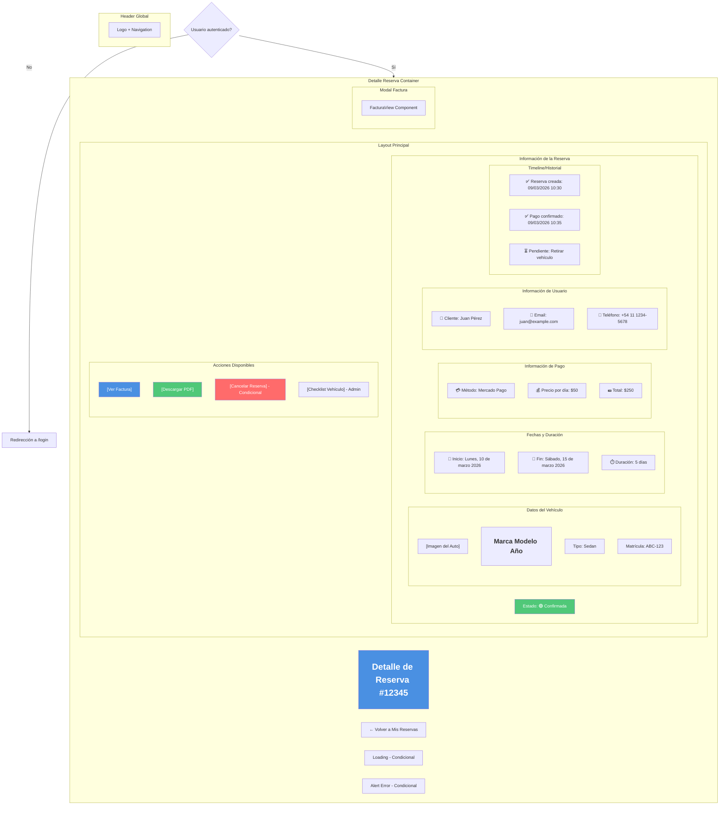
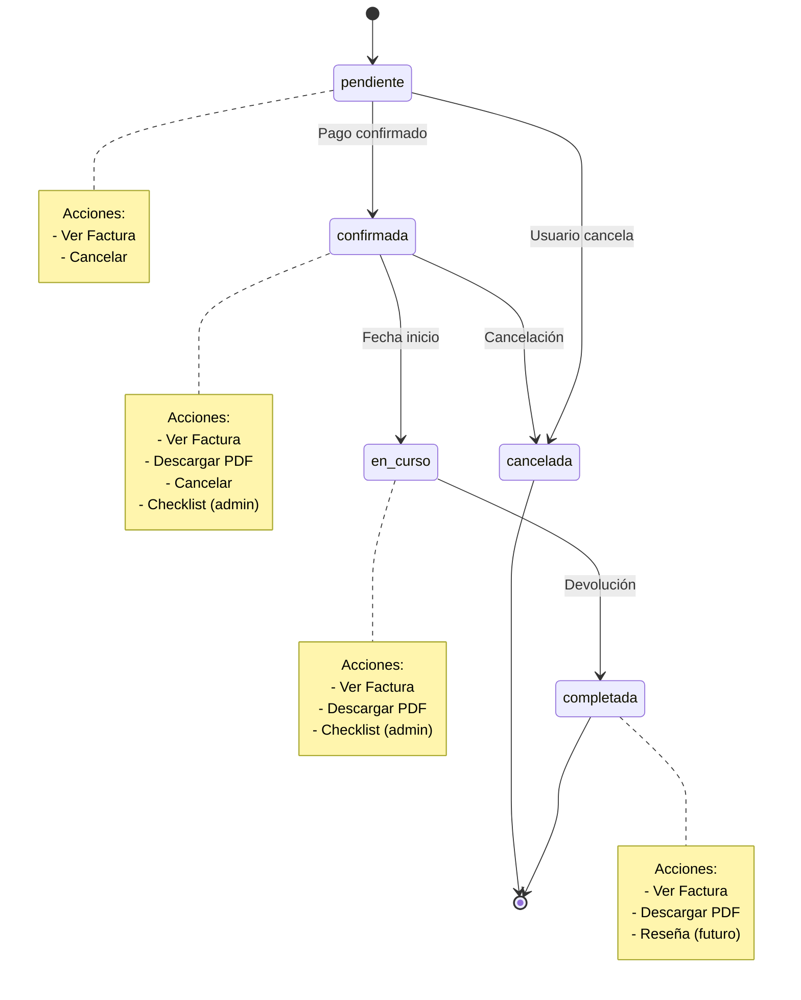
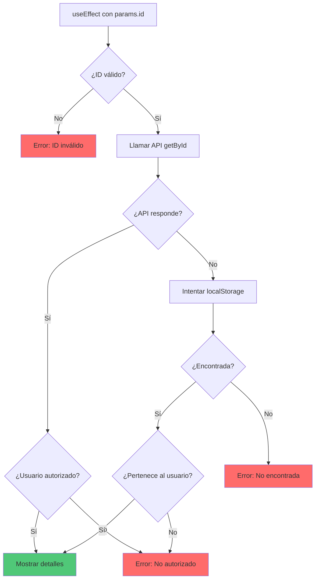
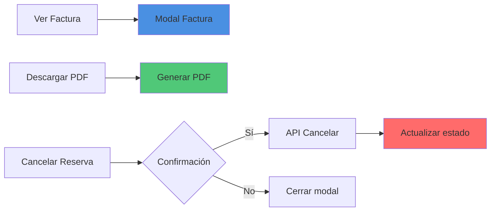

# 🧾 Wireframe: Detalle de Reserva

**Ruta:** `/reservas/[id]`  
**Archivo:** `rentacar/front/files/src/app/reservas/[id]/page.js`  
**Acceso:** Requiere autenticación

## 📐 Estructura Visual



## 🎨 Secciones Principales

### 1. Header de Reserva
```
┌─────────────────────────────────┐
│  Detalle de Reserva #12345      │
│  ← Volver a Mis Reservas        │
│                                 │
│  Estado: 🟢 Confirmada          │
└─────────────────────────────────┘
```

### 2. Card de Información del Vehículo
```
┌─────────────────────────────────┐
│  🚗 VEHÍCULO                    │
├─────────────────────────────────┤
│  ┌─────────┐                    │
│  │ [Imagen]│  Toyota Corolla    │
│  │  Auto   │  2023              │
│  └─────────┘                    │
│              Tipo: Sedan        │
│              Matrícula: ABC-123 │
└─────────────────────────────────┘
```

### 3. Card de Fechas
```
┌─────────────────────────────────┐
│  📅 FECHAS Y DURACIÓN           │
├─────────────────────────────────┤
│  Inicio:                        │
│  Lunes, 10 de marzo de 2026     │
│  10:00 AM                       │
│                                 │
│  Fin:                           │
│  Sábado, 15 de marzo de 2026    │
│  10:00 AM                       │
│                                 │
│  ⏱️ Duración: 5 días             │
└─────────────────────────────────┘
```

### 4. Card de Pago
```
┌─────────────────────────────────┐
│  💰 INFORMACIÓN DE PAGO         │
├─────────────────────────────────┤
│  Método de Pago:                │
│  💳 Mercado Pago                │
│                                 │
│  Precio por día: $50.00         │
│  × 5 días                       │
│  ────────────────────           │
│  TOTAL: $250.00                 │
└─────────────────────────────────┘
```

### 5. Timeline de Eventos
```
┌─────────────────────────────────┐
│  📜 HISTORIAL                   │
├─────────────────────────────────┤
│  ● ✅ Reserva creada            │
│     09/03/2026 - 10:30 AM       │
│                                 │
│  ● ✅ Pago confirmado           │
│     09/03/2026 - 10:35 AM       │
│                                 │
│  ● ⏳ Vehículo a retirar        │
│     10/03/2026 - 10:00 AM       │
│                                 │
│  ● ⏹️ Devolución esperada       │
│     15/03/2026 - 10:00 AM       │
└─────────────────────────────────┘
```

## 🏷️ Estados y Acciones Disponibles



### Matriz de Acciones por Estado

| Acción | Pendiente | Confirmada | En Curso | Completada | Cancelada |
|--------|-----------|------------|----------|------------|-----------|
| Ver Factura | ✅ | ✅ | ✅ | ✅ | ✅ |
| Descargar PDF | ✅ | ✅ | ✅ | ✅ | ✅ |
| Cancelar | ✅ | ✅ | ❌ | ❌ | ❌ |
| Checklist (admin) | ❌ | ✅ | ✅ | ✅ | ❌ |
| Modificar | ❌ | ❌ | ❌ | ❌ | ❌ |

## 🔄 Flujo de Carga de Datos



## 📊 Estados de la Página

### Estado 1: Loading
```
┌───────────────────┐
│ Detalle Reserva   │
│                   │
│  ⏳ Cargando      │
│  información...   │
│                   │
└───────────────────┘
```

### Estado 2: Cargada y Visualizable
```
┌─────────────────────────────────┐
│ Detalle de Reserva #12345       │
│ ← Volver                        │
│                                 │
│ Estado: 🟢 Confirmada           │
├─────────────────────────────────┤
│ [Imagen Auto]  Toyota Corolla   │
│                2023 - Sedan     │
│                                 │
│ 📅 10/03/2026 - 15/03/2026      │
│ ⏱️ 5 días                        │
│                                 │
│ 💳 Mercado Pago                 │
│ 💰 Total: $250                  │
│                                 │
│ 👤 Juan Pérez                   │
│ 📧 juan@example.com             │
├─────────────────────────────────┤
│ [Ver Factura] [Descargar PDF]   │
│ [❌ Cancelar Reserva]           │
└─────────────────────────────────┘
```

### Estado 3: Error - No Encontrada
```
┌─────────────────────┐
│ Detalle Reserva     │
│                     │
│  ❌ No encontrada   │
│                     │
│  La reserva no      │
│  existe o no        │
│  tienes acceso      │
│                     │
│  [← Volver]         │
└─────────────────────┘
```

## 🧾 Modal de Factura

```
┌─────────────────────────────────────┐
│  ✕                                  │
│  FACTURA DE RESERVA                 │
│  ═══════════════════════════════    │
│                                     │
│  RentaCar                           │
│  Reserva #12345                     │
│                                     │
│  CLIENTE:                           │
│  Juan Pérez                         │
│  juan@example.com                   │
│  +54 11 1234-5678                   │
│                                     │
│  VEHÍCULO:                          │
│  Toyota Corolla 2023                │
│  Matrícula: ABC-123                 │
│                                     │
│  PERÍODO:                           │
│  10/03/2026 - 15/03/2026           │
│  Duración: 5 días                   │
│                                     │
│  DETALLE:                           │
│  ────────────────────────────       │
│  Alquiler (5 días × $50)    $250    │
│  ────────────────────────────       │
│  TOTAL                      $250    │
│  ════════════════════════════       │
│                                     │
│  Método de pago: Mercado Pago       │
│  Estado: Confirmada                 │
│                                     │
│  [Imprimir] [Descargar PDF] [Cerrar]│
└─────────────────────────────────────┘
```

## 📱 Layout Responsivo

### Desktop (2 columnas)
```
┌────────────────────────────────────┐
│  Detalle de Reserva #12345         │
│  ← Volver                          │
├────────────────────────────────────┤
│                                    │
│  ┌─────────┐  ┌─────────────────┐ │
│  │ Vehículo│  │ Fechas          │ │
│  │ [Imagen]│  │ Inicio/Fin      │ │
│  │ Info    │  │ Duración        │ │
│  └─────────┘  └─────────────────┘ │
│                                    │
│  ┌─────────────┐  ┌──────────────┐│
│  │ Pago        │  │ Timeline     ││
│  │ Método      │  │ Eventos      ││
│  │ Total       │  │ Historial    ││
│  └─────────────┘  └──────────────┘│
│                                    │
│  [Acciones disponibles]            │
└────────────────────────────────────┘
```

### Mobile (Stack)
```
┌──────────────┐
│ Reserva #12  │
│ ← Volver     │
├──────────────┤
│ 🟢 Confirmada│
│              │
│ [Imagen]     │
│ Toyota Cor.  │
│              │
│ 📅 Fechas    │
│ 10-15 mar    │
│              │
│ 💰 Pago      │
│ Total: $250  │
│              │
│ 👤 Cliente   │
│ Juan Pérez   │
│              │
│ 📜 Timeline  │
│ [Eventos]    │
│              │
│ [Acciones]   │
└──────────────┘
```

## 🔗 Navegación y Acciones

### Botones de Acción



### Enlaces

- **← Volver** → `/reservas`
- **Ver Auto** → `/autos/[autoId]`
- **Contacto Soporte** → `/soporte` o email

## 💡 Características Especiales

1. **Timeline visual:** Progreso de la reserva
2. **Información completa:** Todo en una vista
3. **Factura embebida:** Modal con FacturaView
4. **Estado dinámico:** Badges de color
5. **Acciones contextuales:** Según estado
6. **Validación de propiedad:** Solo el usuario dueño puede ver
7. **Admin view:** Si es admin, ve todas las reservas
