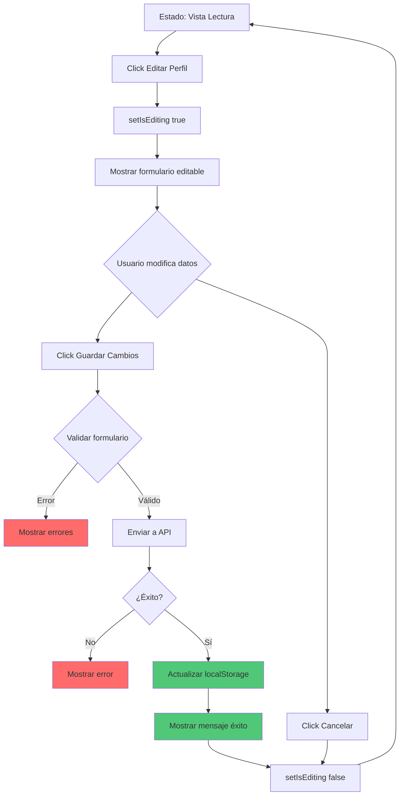
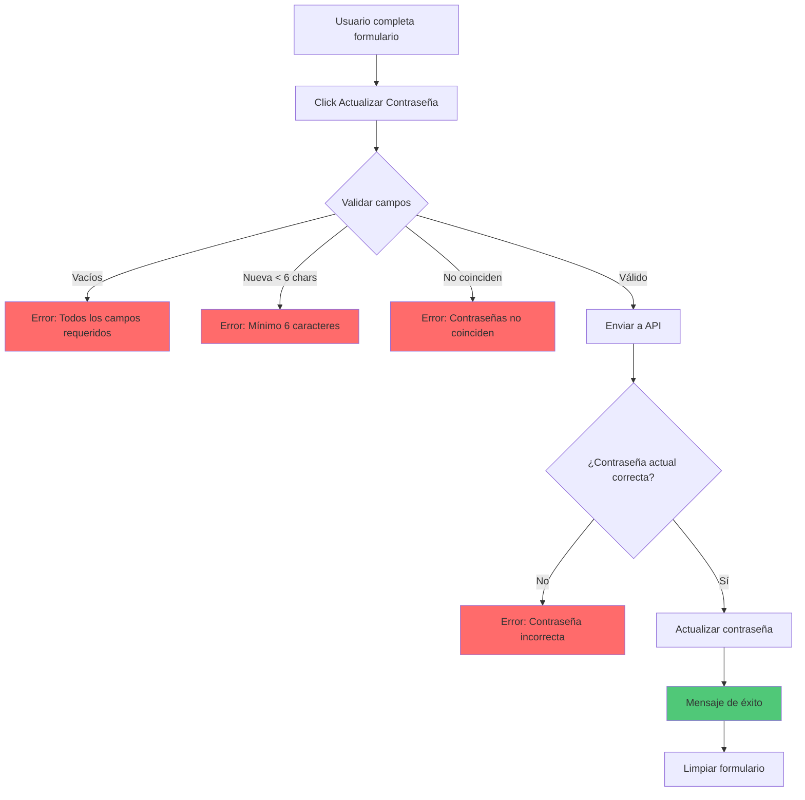
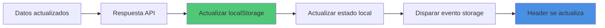
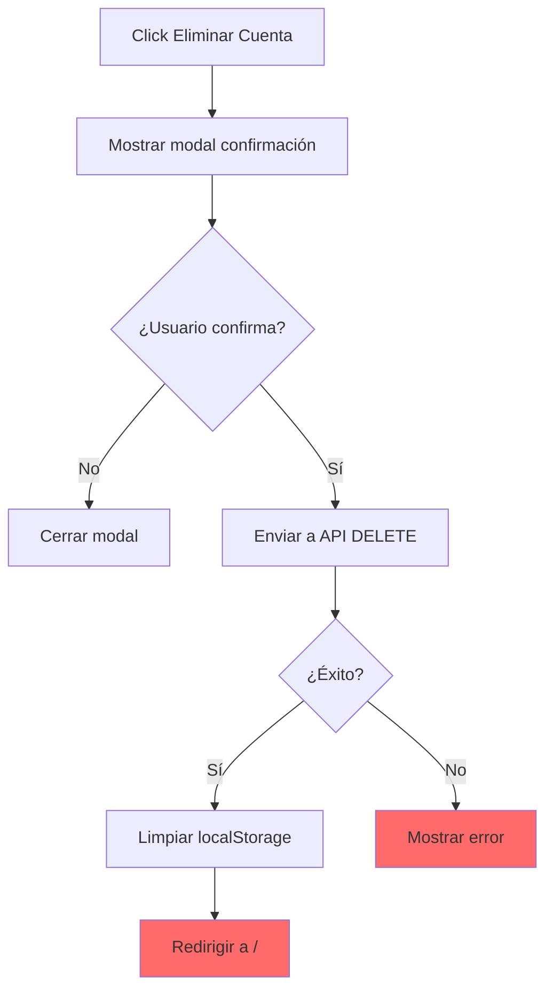

# 👤 Wireframe: Perfil de Usuario

**Ruta:** `/perfil`  
**Archivo:** `rentacar/front/files/src/app/perfil/page.js`  
**Acceso:** Requiere autenticación

## 📐 Estructura Visual

```mermaid
graph TB
    subgraph "Header Global"
        H[Logo + Navigation]
    end
    
    AUTH{Usuario autenticado?}
    AUTH -->|No| REDIR[Redirección a /login]
    AUTH -->|Sí| CONT
    
    subgraph CONT["Perfil Container"]
        T["<h1>Mi Perfil</h1>"]
        MODE["[Botón] Editar Perfil / Cancelar"]
        
        E[Alert Error - Condicional]
        S[Alert Success - Condicional]
        
        subgraph "Información del Usuario - 2 Columnas"
            subgraph "Vista Modo Lectura"
                R1["Nombre: Juan Pérez"]
                R2["Email: juan@example.com"]
                R3["Teléfono: +54 11 1234-5678"]
                R4["Rol: Cliente / Admin"]
                R5["Miembro desde: 01/01/2026"]
            end
            
            subgraph "Vista Modo Edición"
                F1["Nombre <input value='Juan'>"]
                F2["Apellido <input value='Pérez'>"]
                F3["Email <input value='juan@example.com'>"]
                F4["Teléfono <input value='+54...'>"]
                FE["Errores de validación"]
                FB["[Guardar Cambios]"]
                FC["[Cancelar]"]
            end
        end
        
        subgraph "Sección Seguridad"
            PS["<h2>Cambiar Contraseña</h2>"]
            P1["Contraseña Actual <input type='password'>"]
            P2["Nueva Contraseña <input type='password'>"]
            P3["Confirmar Contraseña <input type='password'>"]
            PB["[Actualizar Contraseña]"]
        end
        
        subgraph "Acciones Peligrosas"
            DEL["<h2>Zona de Peligro</h2>"]
            DELB["[Eliminar Cuenta]"]
        end
    end
    
    style T fill:#4a90e2,color:#fff
    style MODE fill:#50c878,color:#fff
    style E fill:#ff6b6b,color:#fff
    style S fill:#50c878,color:#fff
    style FB fill:#50c878,color:#fff
    style PB fill:#4a90e2,color:#fff
    style DELB fill:#ff6b6b,color:#fff
```



## 🎯 Dos Modos de Vista

### Modo 1: Lectura (Default)
```
┌─────────────────────────────┐
│       Mi Perfil             │
│                             │
│     [Editar Perfil] 🖊️     │
├─────────────────────────────┤
│                             │
│  Información Personal       │
│                             │
│  Nombre: Juan Pérez         │
│  Email: juan@example.com    │
│  Teléfono: +54 11 1234-5678 │
│  Rol: Cliente               │
│  Miembro desde: 01/01/2026  │
│                             │
├─────────────────────────────┤
│  Cambiar Contraseña         │
│  [Formulario oculto]        │
└─────────────────────────────┘
```

### Modo 2: Edición
```
┌─────────────────────────────┐
│       Mi Perfil             │
│                             │
│       [Cancelar] ❌         │
├─────────────────────────────┤
│                             │
│  Información Personal       │
│                             │
│  Nombre:    [Juan      ]    │
│  Apellido:  [Pérez     ]    │
│  Email:     [juan@...  ]    │
│  Teléfono:  [+54 11... ]    │
│                             │
│  [Guardar Cambios] ✅       │
│                             │
├─────────────────────────────┤
│  Cambiar Contraseña         │
│  (Sección separada)         │
└─────────────────────────────┘
```

## 🔄 Flujo de Edición de Perfil



## 🔐 Cambio de Contraseña



### Campos del Formulario de Contraseña

| Campo | Tipo | Validación |
|-------|------|-----------|
| Contraseña Actual | password | Requerido, debe ser correcta |
| Nueva Contraseña | password | Requerido, min 6 caracteres |
| Confirmar Contraseña | password | Requerido, debe coincidir |

## 📊 Estados de la Página

### Estado 1: Loading
```
┌─────────────────┐
│   Mi Perfil     │
│                 │
│  ⏳ Cargando    │
│  información... │
│                 │
└─────────────────┘
```

### Estado 2: Vista Lectura
```
┌────────────────────────────┐
│        Mi Perfil           │
│     [Editar Perfil] 🖊️    │
├────────────────────────────┤
│  Nombre: Juan Pérez        │
│  Email: juan@example.com   │
│  Teléfono: +54 11 1234     │
│  Rol: Cliente              │
│  Miembro: 01/01/2026       │
├────────────────────────────┤
│  💬 Cambiar Contraseña     │
│  (collapsed)               │
└────────────────────────────┘
```

### Estado 3: Modo Edición
```
┌────────────────────────────┐
│        Mi Perfil           │
│        [Cancelar] ❌       │
├────────────────────────────┤
│  Nombre:    [Juan      ]   │
│  Apellido:  [Pérez     ]   │
│  Email:     [juan@...  ]   │
│  Teléfono:  [+54 11... ]   │
│                            │
│  [Guardar Cambios] ✅      │
└────────────────────────────┘
```

### Estado 4: Guardando
```
┌────────────────────────────┐
│        Mi Perfil           │
├────────────────────────────┤
│                            │
│  ⏳ Guardando cambios...   │
│                            │
│  [Campos deshabilitados]   │
│                            │
└────────────────────────────┘
```

### Estado 5: Éxito
```
┌────────────────────────────┐
│        Mi Perfil           │
│  ✅ Perfil actualizado     │
├────────────────────────────┤
│  Nombre: Juan Pérez        │
│  Email: juan@example.com   │
│  (Datos actualizados)      │
└────────────────────────────┘
```

### Estado 6: Error
```
┌────────────────────────────┐
│        Mi Perfil           │
│  ❌ Error al actualizar    │
├────────────────────────────┤
│  [Formulario con errores]  │
│  Email: Error de formato   │
│                            │
│  [Guardar] [Cancelar]      │
└────────────────────────────┘
```

## 📋 Validaciones del Formulario

### Información Personal
```javascript
✅ Nombre: No vacío
✅ Apellido: No vacío (si existe el campo)
✅ Email: Formato válido
✅ Teléfono: Formato válido (opcional)
```

### Cambio de Contraseña
```javascript
✅ Contraseña Actual: No vacía
✅ Nueva Contraseña: Mínimo 6 caracteres
✅ Confirmar: Debe coincidir con nueva
✅ API valida: Contraseña actual correcta
```

## 💾 Actualización de Datos



### LocalStorage Update
```javascript
// Actualizar usuario en localStorage
const updatedUser = { ...user, ...formData };
localStorage.setItem('user', JSON.stringify(updatedUser));

// Disparar evento para otros componentes
window.dispatchEvent(new Event('storage'));
```

## 📱 Layout Responsivo

### Desktop (Grid 2 columnas)
```
┌────────────────────────────────┐
│          Mi Perfil             │
│       [Editar Perfil]          │
├────────────────────────────────┤
│                                │
│  Información      │ Seguridad  │
│  Personal         │            │
│                   │ Cambiar    │
│  [Datos]          │ Contraseña │
│  [Campos]         │            │
│                   │ [Formulario│
│  [Guardar]        │  Password] │
│                   │            │
│                   │ [Actualizar│
└────────────────────────────────┘
```

### Mobile (Stack)
```
┌──────────────┐
│  Mi Perfil   │
│  [Editar]    │
├──────────────┤
│ Información  │
│ Personal     │
│              │
│ [Datos]      │
│ [Campos]     │
│              │
│ [Guardar]    │
├──────────────┤
│ Cambiar      │
│ Contraseña   │
│              │
│ [Campos]     │
│              │
│ [Actualizar] │
└──────────────┘
```

## 🚨 Zona de Peligro (Opcional)

```
┌───────────────────────────┐
│  ⚠️ Zona de Peligro       │
├───────────────────────────┤
│  Eliminar Cuenta          │
│                           │
│  Esta acción es           │
│  irreversible             │
│                           │
│  [Eliminar Cuenta] 🗑️    │
└───────────────────────────┘
```

### Flujo de Eliminación


## 🔗 Integración con Otros Componentes

### Header
```javascript
// El Header escucha cambios
window.addEventListener('storage', handleStorageChange);

// Cuando se actualiza perfil, Header muestra nuevo nombre
```

## 📅 Información de Cuenta

| Campo | Descripción | Editable |
|-------|-------------|----------|
| Nombre | Nombre del usuario | ✅ Sí |
| Apellido | Apellido del usuario | ✅ Sí |
| Email | Email de contacto | ✅ Sí |
| Teléfono | Teléfono (opcional) | ✅ Sí |
| Rol | admin / cliente | ❌ No |
| Miembro desde | Fecha de registro | ❌ No |

## ✨ Características Especiales

1. **Toggle Edit Mode:** Botón cambia entre editar/cancelar
2. **Validación en tiempo real:** Errores se limpian al escribir
3. **Sincronización:** Cambios se reflejan en Header
4. **Separación de concerns:** Perfil y contraseña separados
5. **Feedback visual:** Success/Error messages claros
6. **Protección:** Zona de peligro bien marcada
