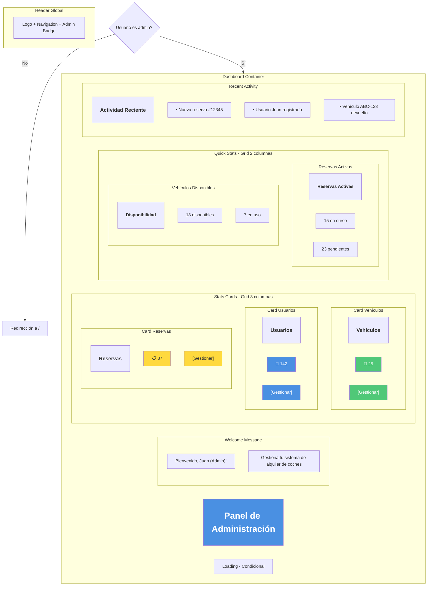
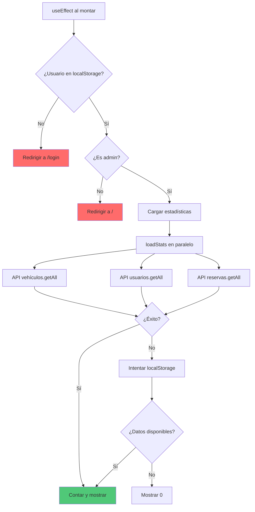

# 👨‍💼 Wireframe: Dashboard Principal (Admin)

**Ruta:** `/dashboard`  
**Archivo:** `rentacar/front/files/src/app/dashboard/page.js`  
**Acceso:** Solo administradores

## 📐 Estructura Visual



## 🎨 Cards de Estadísticas Principales

### Card de Vehículos
```
┌─────────────────────┐
│  Vehículos          │
│                     │
│      🚗             │
│       25            │
│                     │
│  Total de vehículos │
│  en el sistema      │
│                     │
│  [Gestionar]        │
└─────────────────────┘
```

### Card de Usuarios
```
┌─────────────────────┐
│  Usuarios           │
│                     │
│      👥             │
│      142            │
│                     │
│  Clientes           │
│  registrados        │
│                     │
│  [Gestionar]        │
└─────────────────────┘
```

### Card de Reservas
```
┌─────────────────────┐
│  Reservas           │
│                     │
│      📋             │
│       87            │
│                     │
│  Total de reservas  │
│  realizadas         │
│                     │
│  [Gestionar]        │
└─────────────────────┘
```

## 📊 Estadísticas Detalladas

### Sección de Reservas Activas
```
┌─────────────────────────────┐
│  📊 Reservas Activas        │
├─────────────────────────────┤
│                             │
│  🔵 En curso:        15     │
│  🟡 Pendientes:      23     │
│  🟢 Confirmadas:     18     │
│  ⏹️ Por iniciar hoy:  3     │
│                             │
│  [Ver Todas las Reservas]   │
└─────────────────────────────┘
```

### Sección de Vehículos
```
┌─────────────────────────────┐
│  🚗 Estado de Vehículos     │
├─────────────────────────────┤
│                             │
│  🟢 Disponibles:     18     │
│  🔵 En uso:           7     │
│  ⚠️ Mantenimiento:    2     │
│  ❌ No disponibles:   3     │
│                             │
│  Tasa de ocupación:  28%    │
│                             │
│  [Ver Todos los Vehículos]  │
└─────────────────────────────┘
```

## 🔄 Flujo de Carga de Datos



## 📊 Estados de la Página

### Estado 1: Loading
```
┌─────────────────────────┐
│ Panel de Administración │
│                         │
│  ⏳ Cargando            │
│  estadísticas...        │
│                         │
└─────────────────────────┘
```

### Estado 2: Dashboard Cargado
```
┌───────────────────────────────────────┐
│  Panel de Administración              │
│  Bienvenido, Juan!                    │
├───────────────────────────────────────┤
│                                       │
│  ┌────────┐ ┌────────┐ ┌────────┐   │
│  │ 🚗 25  │ │ 👥 142 │ │ 📋 87  │   │
│  │Vehículo│ │Usuario │ │Reserva │   │
│  │[Gestión│ │[Gestión│ │[Gestión│   │
│  └────────┘ └────────┘ └────────┘   │
│                                       │
│  ┌────────────────┐ ┌──────────────┐│
│  │ Reservas       │ │ Vehículos    ││
│  │ • En curso: 15 │ │ • Disp.: 18  ││
│  │ • Pend.: 23    │ │ • Uso: 7     ││
│  └────────────────┘ └──────────────┘│
│                                       │
│  Actividad Reciente:                  │
│  • Nueva reserva #12345               │
│  • Usuario registrado                 │
│  • Vehículo devuelto                  │
└───────────────────────────────────────┘
```

### Estado 3: Sin Datos (Sistema Nuevo)
```
┌───────────────────────────────────────┐
│  Panel de Administración              │
│  Bienvenido, Admin!                   │
├───────────────────────────────────────┤
│                                       │
│  ┌────────┐ ┌────────┐ ┌────────┐   │
│  │ 🚗 0   │ │ 👥 0   │ │ 📋 0   │   │
│  │Vehículo│ │Usuario │ │Reserva │   │
│  │[Agregar│ │        │ │        │   │
│  └────────┘ └────────┘ └────────┘   │
│                                       │
│  ℹ️ Comienza agregando vehículos     │
│  al sistema                           │
└───────────────────────────────────────┘
```

## 🎯 Botones de Acción

```mermaid
graph LR
    A[Gestionar Vehículos] --> B[/dashboard/vehiculos]
    C[Gestionar Usuarios] --> D[/dashboard/usuarios]
    E[Gestionar Reservas] --> F[/dashboard/reservas]
    
    style A fill:#50c878
    style C fill:#4a90e2
    style E fill:#ffd93d
```

## 📱 Layout Responsivo

### Desktop (Grid 3 columnas para stats)
```
┌────────────────────────────────────┐
│     Panel de Administración        │
│     Bienvenido, Juan!              │
├────────────────────────────────────┤
│                                    │
│  [Vehículos] [Usuarios] [Reservas] │
│     25          142         87     │
│  [Gestionar] [Gestionar] [Gestionar]
│                                    │
├────────────────────────────────────┤
│                                    │
│  [Reservas Activas] [Vehículos]    │
│  • En curso: 15     • Disp.: 18    │
│  • Pend.: 23        • Uso: 7       │
│                                    │
├────────────────────────────────────┤
│  Actividad Reciente                │
│  • Item 1                          │
│  • Item 2                          │
└────────────────────────────────────┘
```

### Tablet (Grid 2 columnas)
```
┌────────────────────────┐
│  Panel Admin           │
│  Bienvenido, Juan!     │
├────────────────────────┤
│ [Vehículos] [Usuarios] │
│    25          142     │
│                        │
│ [Reservas]             │
│    87                  │
├────────────────────────┤
│ [Stats en 2 columnas]  │
└────────────────────────┘
```

### Mobile (Stack)
```
┌──────────────┐
│ Panel Admin  │
│ Bienvenido!  │
├──────────────┤
│ Vehículos    │
│    25        │
│ [Gestionar]  │
├──────────────┤
│ Usuarios     │
│   142        │
│ [Gestionar]  │
├──────────────┤
│ Reservas     │
│    87        │
│ [Gestionar]  │
├──────────────┤
│ [Estadíst.]  │
│ [Actividad]  │
└──────────────┘
```

## 📈 Actividad Reciente

```
┌─────────────────────────────────┐
│  📜 Actividad Reciente          │
├─────────────────────────────────┤
│  🟢 Nueva reserva creada        │
│     #12345 - Toyota Corolla     │
│     Hace 5 minutos              │
│                                 │
│  👤 Nuevo usuario registrado    │
│     Juan Pérez                  │
│     Hace 1 hora                 │
│                                 │
│  ✅ Vehículo devuelto           │
│     ABC-123 - Honda Civic       │
│     Hace 2 horas                │
│                                 │
│  [Ver Todas las Actividades]    │
└─────────────────────────────────┘
```

## 💾 Cálculo de Estadísticas

### Funciones de Conteo
```javascript
// Cargar en paralelo
const [vehiculosCount, usuariosCount, reservasCount] = 
  await Promise.all([
    loadDataCount(apiService.autos, 'autos'),
    loadDataCount(apiService.usuarios, 'usuarios'),
    loadDataCount(apiService.reservas, 'reservas')
  ]);

// Con fallback a localStorage
const loadDataCount = async (service, storageKey) => {
  try {
    const response = await service.getAll();
    if (response.success) return response.data.length;
  } catch {
    // Fallback
    const localData = localStorage.getItem(`rentacar_${storageKey}`);
    if (localData) return JSON.parse(localData).length;
  }
  return 0;
};
```

## 🔔 Sistema de Eventos

### Escucha de Actualizaciones
```javascript
// Actualizar stats cuando hay cambios en otras páginas
useEffect(() => {
  const handleStorageChange = () => loadStats();
  
  window.addEventListener('storage', handleStorageChange);
  window.addEventListener('rentacarDataUpdate', handleStorageChange);
  
  return () => {
    window.removeEventListener('storage', handleStorageChange);
    window.removeEventListener('rentacarDataUpdate', handleStorageChange);
  };
}, []);
```

## 🔗 Navegación Rápida

| Sección | Ruta | Descripción |
|---------|------|-------------|
| Vehículos | `/dashboard/vehiculos` | CRUD de vehículos |
| Usuarios | `/dashboard/usuarios` | Gestión de usuarios |
| Reservas | `/dashboard/reservas` | Gestión de reservas |
| Perfil | `/perfil` | Configuración personal |

## ✨ Características Especiales

1. **Actualización en tiempo real:** Stats se actualizan automáticamente
2. **Estadísticas visuales:** Números grandes y claros
3. **Acceso rápido:** Botones directos a cada sección
4. **Fallback offline:** Funciona con localStorage
5. **Welcome message:** Personalizado con nombre del admin
6. **Protected route:** Solo accesible para administradores
7. **Loading states:** Feedback visual mientras carga
