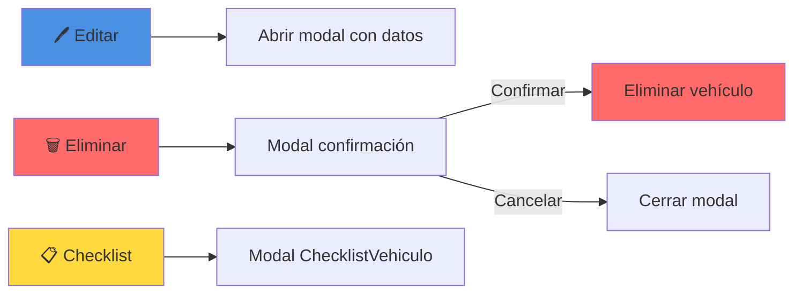
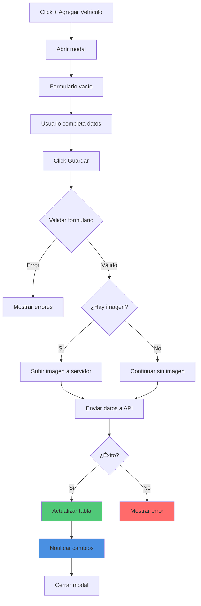
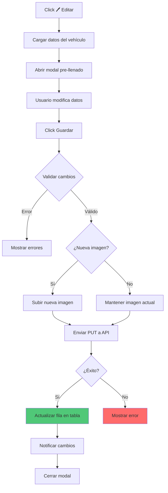
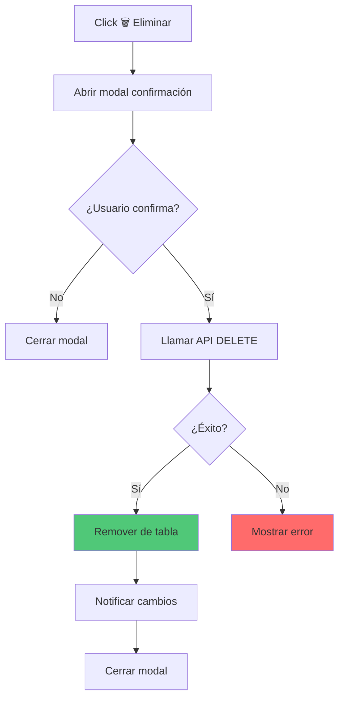
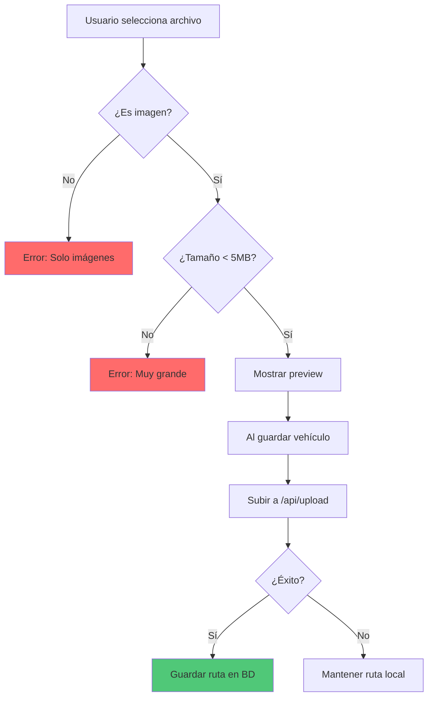

# 🚗 Wireframe: Gestión de Vehículos (Admin)

**Ruta:** `/dashboard/vehiculos`  
**Archivo:** `rentacar/front/files/src/app/dashboard/vehiculos/page.js`  
**Acceso:** Solo administradores

## 📐 Estructura Visual

```mermaid
graph TB
    subgraph "Header Global"
        H[Logo + Navigation + Admin Badge]
    end
    
    AUTH{Usuario es admin?}
    AUTH -->|No| REDIR[Redirección a /]
    AUTH -->|Sí| CONT
    
    subgraph CONT["Gestión de Vehículos Container"]
        T["<h1>Gestión de Vehículos</h1>"]
        BTN["[+ Agregar Vehículo]"]
        
        L[Loading - Condicional]
        E[Alert Error - Condicional]
        
        subgraph "DataTable Component"
            DT["Tabla de Vehículos con:<br/>- Búsqueda<br/>- Filtros<br/>- Ordenamiento<br/>- Paginación"]
        end
        
        NV["📭 No hay vehículos<br/>[Agregar Primero]"]
    end
    
    subgraph "Modal Agregar/Editar"
        subgraph "Formulario Vehículo"
            F1["Marca * <input>"]
            F2["Modelo * <input>"]
            F3["Año * <input type='number'>"]
            F4["Matrícula * <input>"]
            F5["Color * <input>"]
            F6["Tipo * <select>"]
            F7["Precio Base * <input>"]
            F8["☑ Disponible"]
            F9["Imagen <ImageUploader>"]
        end
        
        FE["Errores de validación"]
        FBTN["[Guardar] [Cancelar]"]
    end
    
    subgraph "Modal Eliminar"
        DEL["¿Seguro que deseas eliminar?<br/>[Confirmar] [Cancelar]"]
    end
    
    subgraph "Modal Checklist"
        CL["ChecklistVehiculo Component"]
    end
    
    style T fill:#4a90e2,color:#fff
    style BTN fill:#50c878,color:#fff
    style FBTN fill:#50c878,color:#fff
    style DEL fill:#ff6b6b,color:#fff
```



## 📊 DataTable de Vehículos

### Estructura de la Tabla

| Columna | Tipo | Ordenable | Filtrable |
|---------|------|-----------|-----------|
| Imagen | image | ❌ | ❌ |
| Marca | text | ✅ | ✅ |
| Modelo | text | ✅ | ✅ |
| Año | number | ✅ | ✅ |
| Tipo | badge | ✅ | ✅ |
| Matrícula | text | ✅ | ✅ |
| Precio/día | currency | ✅ | ❌ |
| Disponible | badge | ✅ | ✅ |
| Acciones | buttons | ❌ | ❌ |

### Vista de la Tabla
```
┌─────────────────────────────────────────────────────────────┐
│  Gestión de Vehículos              [+ Agregar Vehículo]     │
├─────────────────────────────────────────────────────────────┤
│  🔍 Buscar: [____________]  Filtros: [Tipo▼] [Disponib.▼]  │
├──────┬───────┬────────┬──────┬──────┬────────┬──────┬──────┤
│ Img  │ Marca │ Modelo │ Año  │ Tipo │ Precio │ Disp │ Acc. │
├──────┼───────┼────────┼──────┼──────┼────────┼──────┼──────┤
│ [🚗] │Toyota │Corolla │ 2023 │Sedan │  $50   │  ✅  │ ⚙️📋 │
│ [🚗] │Honda  │Civic   │ 2022 │Sedan │  $45   │  ✅  │ ⚙️📋 │
│ [🚙] │Ford   │Explorer│ 2023 │ SUV  │  $75   │  ❌  │ ⚙️📋 │
│ [🚗] │Chevy  │Spark   │ 2021 │Comp. │  $35   │  ✅  │ ⚙️📋 │
├──────┴───────┴────────┴──────┴──────┴────────┴──────┴──────┤
│                    ← 1 2 3 →  Mostrando 1-10 de 25         │
└─────────────────────────────────────────────────────────────┘
```

## 🎨 Botones de Acción por Fila



## 📝 Modal de Agregar/Editar Vehículo

### Formulario Completo
```
┌─────────────────────────────────────┐
│  ✕  Agregar Vehículo                │
├─────────────────────────────────────┤
│                                     │
│  Marca *            Modelo *        │
│  [Toyota        ]   [Corolla    ]   │
│                                     │
│  Año *              Matrícula *     │
│  [2023    ]         [ABC-123    ]   │
│                                     │
│  Color *            Tipo *          │
│  [Blanco    ]       [Sedan ▼    ]   │
│                                     │
│  Precio Base * (por día)            │
│  [50        ]                       │
│                                     │
│  ☑ Disponible                       │
│                                     │
│  Imagen del Vehículo                │
│  ┌─────────────────────────┐        │
│  │ [ImageUploader]         │        │
│  │ Arrastra aquí o haz     │        │
│  │ clic para seleccionar   │        │
│  └─────────────────────────┘        │
│                                     │
│  [Guardar Vehículo] [Cancelar]      │
└─────────────────────────────────────┘
```

### Tipos de Vehículo (Select)
- Sedan
- SUV
- Compacto
- Deportivo
- Camioneta
- Van
- Lujo

## 🔄 Flujo de Gestión de Vehículos

### Agregar Vehículo


### Editar Vehículo


### Eliminar Vehículo


## 📋 Validaciones del Formulario

### Validaciones Requeridas
```javascript
✅ Marca: No vacía
✅ Modelo: No vacío
✅ Año: Número entre 1900 y añoActual+1
✅ Matrícula: No vacía, formato válido
✅ Color: No vacío
✅ Tipo: Seleccionado
✅ Precio Base: Número > 0
```

### Ejemplos de Validación
```javascript
// Año
if (año < 1900 || año > new Date().getFullYear() + 1) {
  error = "Año inválido"
}

// Precio
if (precioBase <= 0) {
  error = "El precio debe ser mayor a 0"
}

// Matrícula
if (!matricula.match(/^[A-Z]{3}-\d{3}$/)) {
  error = "Formato: ABC-123"
}
```

## 🖼️ Image Uploader Component

```
┌───────────────────────────────┐
│  Imagen del Vehículo          │
├───────────────────────────────┤
│                               │
│  Sin imagen:                  │
│  ┌─────────────────────────┐  │
│  │  📁 Arrastra aquí       │  │
│  │  o haz clic para        │  │
│  │  seleccionar            │  │
│  └─────────────────────────┘  │
│                               │
│  Con imagen:                  │
│  ┌─────────────────────────┐  │
│  │  [Vista Previa]         │  │
│  │  corolla.jpg            │  │
│  │  [Cambiar] [Eliminar]   │  │
│  └─────────────────────────┘  │
└───────────────────────────────┘
```

### Flujo de Subida de Imagen


## 📊 Estados de la Página

### Estado 1: Loading
```
┌─────────────────────────┐
│ Gestión de Vehículos    │
│                         │
│  ⏳ Cargando            │
│  vehículos...           │
│                         │
└─────────────────────────┘
```

### Estado 2: Con Datos
```
┌─────────────────────────────────────┐
│ Gestión de Vehículos  [+ Agregar]   │
├─────────────────────────────────────┤
│ 🔍 [Buscar] [Filtros]               │
├─────────────────────────────────────┤
│ [Tabla con 25 vehículos]            │
│ [Paginación]                        │
└─────────────────────────────────────┘
```

### Estado 3: Sin Vehículos
```
┌─────────────────────────────────────┐
│ Gestión de Vehículos  [+ Agregar]   │
├─────────────────────────────────────┤
│                                     │
│  📭 No hay vehículos registrados    │
│                                     │
│  Comienza agregando tu primer       │
│  vehículo al sistema                │
│                                     │
│  [+ Agregar Primer Vehículo]        │
└─────────────────────────────────────┘
```

### Estado 4: Modal Abierto
```
┌─────────────────────────────────────┐
│ [Overlay oscuro]                    │
│                                     │
│  ┌───────────────────────────────┐  │
│  │ ✕ Agregar Vehículo            │  │
│  ├───────────────────────────────┤  │
│  │ [Formulario completo]         │  │
│  │ [Campos de entrada]           │  │
│  │                               │  │
│  │ [Guardar] [Cancelar]          │  │
│  └───────────────────────────────┘  │
└─────────────────────────────────────┘
```

## 📱 Layout Responsivo

### Desktop
```
┌──────────────────────────────────────┐
│  Gestión de Vehículos  [+ Agregar]   │
├──────────────────────────────────────┤
│  🔍 [_______]  [Tipo▼] [Disp.▼]     │
├──────────────────────────────────────┤
│  [Tabla completa - Todas columnas]   │
│  Img Marca Modelo Año Tipo $ Disp    │
│  [Paginación avanzada]               │
└──────────────────────────────────────┘
```

### Mobile
```
┌──────────────┐
│ Vehículos    │
│ [+ Agregar]  │
├──────────────┤
│ 🔍 [____]    │
│ [Filtros]    │
├──────────────┤
│ ┌──────────┐ │
│ │ [Img]    │ │
│ │ Toyota   │ │
│ │ Corolla  │ │
│ │ $50/día  │ │
│ │ [⚙️📋🗑️]│ │
│ └──────────┘ │
│ ┌──────────┐ │
│ │ [Card 2] │ │
│ └──────────┘ │
└──────────────┘
```

## 💾 Persistencia y Sincronización

### Eventos de Actualización
```javascript
// Al crear/editar/eliminar
notifyDataChange(); // Dispara eventos

// Otros componentes escuchan
window.addEventListener('rentacarDataUpdate', loadData);

// LocalStorage se actualiza
localStorage.setItem('rentacar_autos', JSON.stringify(vehiculos));
```

## 🔗 Características Especiales

1. **DataTable reutilizable:** Componente genérico
2. **Búsqueda en tiempo real:** Filtra mientras escribes
3. **Filtros múltiples:** Tipo, disponibilidad
4. **Ordenamiento:** Click en headers
5. **Paginación:** Configurable
6. **Image upload:** Drag & drop
7. **Validación robusta:** Cliente y servidor
8. **Feedback visual:** Loading, success, errors
9. **Responsive:** Mobile-friendly
10. **Checklist integrado:** Para inspecciones
