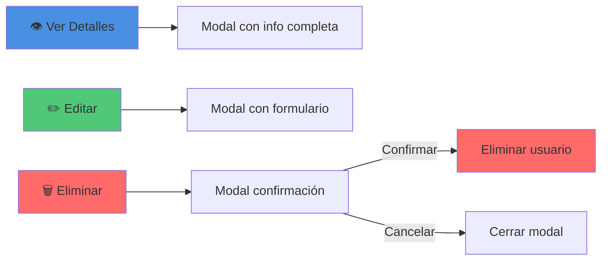
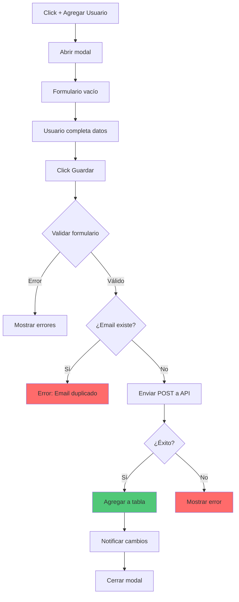
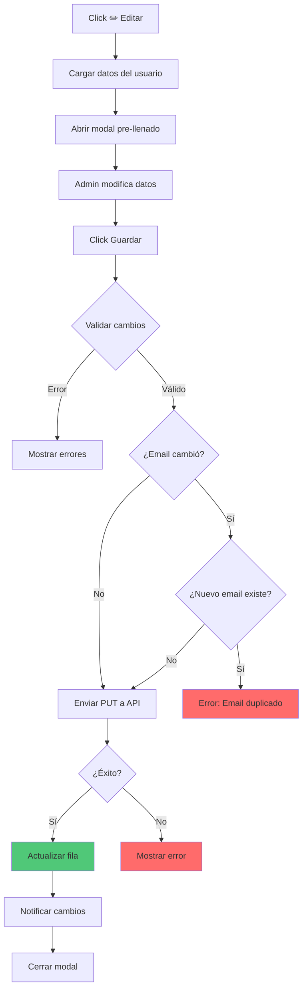
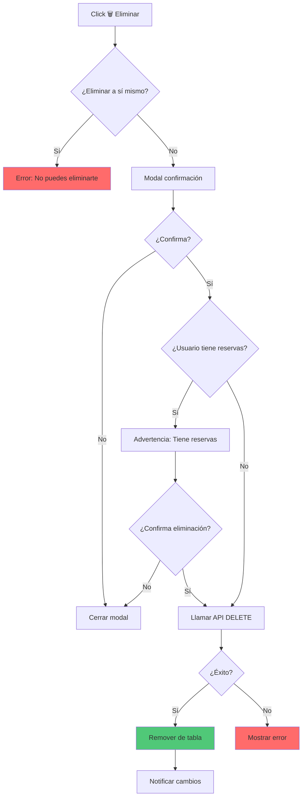

# 👥 Wireframe: Gestión de Usuarios (Admin)

**Ruta:** `/dashboard/usuarios`  
**Archivo:** `rentacar/front/files/src/app/dashboard/usuarios/page.js`  
**Acceso:** Solo administradores

## 📐 Estructura Visual

```mermaid
graph TB
    subgraph "Header Global"
        H[Logo + Navigation + Admin Badge]
    end
    
    AUTH{Usuario es admin?}
    AUTH -->|No| REDIR[Redirección a /]
    AUTH -->|Sí| CONT
    
    subgraph CONT["Gestión de Usuarios Container"]
        T["<h1>Gestión de Usuarios</h1>"]
        BTN["[+ Agregar Usuario]"]
        
        L[Loading - Condicional]
        E[Alert Error - Condicional]
        
        subgraph "DataTable Component"
            DT["Tabla de Usuarios con:<br/>- Búsqueda<br/>- Filtros por rol<br/>- Ordenamiento<br/>- Paginación"]
        end
        
        NU["📭 No hay usuarios<br/>[Agregar Primero]"]
    end
    
    subgraph "Modal Agregar/Editar"
        subgraph "Formulario Usuario"
            F1["Nombre * <input>"]
            F2["Apellido * <input>"]
            F3["Email * <input type='email'>"]
            F4["Teléfono <input>"]
            F5["Rol * <select>"]
            F6["Contraseña * <input> (solo crear)"]
            F7["Tipo Documento <select>"]
            F8["Nº Documento <input>"]
        end
        
        FE["Errores de validación"]
        FBTN["[Guardar] [Cancelar]"]
    end
    
    subgraph "Modal Eliminar"
        DEL["¿Seguro que deseas eliminar?<br/>[Confirmar] [Cancelar]"]
    end
    
    subgraph "Modal Ver Detalles"
        DET["Información completa del usuario"]
    end
    
    style T fill:#4a90e2,color:#fff
    style BTN fill:#50c878,color:#fff
    style FBTN fill:#50c878,color:#fff
    style DEL fill:#ff6b6b,color:#fff
```



## 📊 DataTable de Usuarios

### Estructura de la Tabla

| Columna | Tipo | Ordenable | Filtrable |
|---------|------|-----------|-----------|
| Nombre Completo | text | ✅ | ✅ |
| Email | text | ✅ | ✅ |
| Teléfono | text | ❌ | ❌ |
| Rol | badge | ✅ | ✅ |
| Documento | text | ✅ | ✅ |
| Fecha Registro | date | ✅ | ❌ |
| Reservas | number | ✅ | ❌ |
| Acciones | buttons | ❌ | ❌ |

### Vista de la Tabla
```
┌─────────────────────────────────────────────────────────────────────────┐
│  Gestión de Usuarios                        [+ Agregar Usuario]         │
├─────────────────────────────────────────────────────────────────────────┤
│  🔍 Buscar: [____________]  Filtros: [Rol▼] [Ordenar▼]                 │
├────────────┬─────────────────┬──────────┬────────┬──────────┬──────────┤
│ Nombre     │ Email           │ Teléfono │ Rol    │ Registro │ Acciones │
├────────────┼─────────────────┼──────────┼────────┼──────────┼──────────┤
│ Juan Pérez │juan@example.com │+54 11... │🔴Admin│01/01/26  │ 👁️ ✏️ 🗑️ │
│ Ana López  │ana@example.com  │+54 11... │👤Clien│05/01/26  │ 👁️ ✏️ 🗑️ │
│ Pedro Gómez│pedro@ex.com     │+54 11... │👤Clien│10/01/26  │ 👁️ ✏️ 🗑️ │
│ María Silva│maria@ex.com     │+54 11... │👤Clien│15/01/26  │ 👁️ ✏️ 🗑️ │
├────────────┴─────────────────┴──────────┴────────┴──────────┴──────────┤
│                    ← 1 2 3 4 5 →  Mostrando 1-10 de 142                │
└─────────────────────────────────────────────────────────────────────────┘
```

## 🎨 Badges de Rol

```
Admin:    🔴 Admin     (Rojo)
Cliente:  👤 Cliente   (Azul)
```

## 🎯 Botones de Acción por Fila



## 📝 Modal de Agregar/Editar Usuario

### Formulario Crear Usuario
```
┌─────────────────────────────────────┐
│  ✕  Agregar Usuario                 │
├─────────────────────────────────────┤
│                                     │
│  Información Personal               │
│  ────────────────────────           │
│  Nombre *           Apellido *      │
│  [Juan          ]   [Pérez      ]   │
│                                     │
│  Email *                            │
│  [juan@example.com              ]   │
│                                     │
│  Teléfono (opcional)                │
│  [+54 11 1234-5678              ]   │
│                                     │
│  Documentación                      │
│  ────────────────────────           │
│  Tipo Documento     Nº Documento    │
│  [DNI ▼         ]   [12345678   ]   │
│                                     │
│  Seguridad y Rol                    │
│  ────────────────────────           │
│  Contraseña *                       │
│  [••••••••                      ]   │
│                                     │
│  Confirmar Contraseña *             │
│  [••••••••                      ]   │
│                                     │
│  Rol *                              │
│  ⚪ Cliente                         │
│  ⚪ Administrador                   │
│                                     │
│  [Guardar Usuario] [Cancelar]       │
└─────────────────────────────────────┘
```

### Formulario Editar Usuario
```
┌─────────────────────────────────────┐
│  ✕  Editar Usuario: Juan Pérez      │
├─────────────────────────────────────┤
│                                     │
│  Información Personal               │
│  ────────────────────────           │
│  Nombre *           Apellido *      │
│  [Juan          ]   [Pérez      ]   │
│                                     │
│  Email *                            │
│  [juan@example.com              ]   │
│                                     │
│  Teléfono                           │
│  [+54 11 1234-5678              ]   │
│                                     │
│  Documentación                      │
│  ────────────────────────           │
│  Tipo: DNI                          │
│  Número: 12345678                   │
│  (solo lectura)                     │
│                                     │
│  Rol *                              │
│  ⚫ Cliente                         │
│  ⚪ Administrador                   │
│                                     │
│  ℹ️ La contraseña no se puede      │
│  cambiar desde aquí                 │
│                                     │
│  [Guardar Cambios] [Cancelar]       │
└─────────────────────────────────────┘
```

## 🔄 Flujo de Gestión de Usuarios

### Agregar Usuario


### Editar Usuario


### Eliminar Usuario


## 📋 Validaciones del Formulario

### Crear Usuario
```javascript
✅ Nombre: No vacío
✅ Apellido: No vacío
✅ Email: Formato válido, único
✅ Contraseña: Mínimo 6 caracteres
✅ Confirmar Contraseña: Debe coincidir
✅ Rol: Seleccionado (cliente/admin)
⚠️ Teléfono: Opcional pero formato válido
⚠️ Documento: Opcional
```

### Editar Usuario
```javascript
✅ Nombre: No vacío
✅ Apellido: No vacío
✅ Email: Formato válido, único (si cambió)
✅ Rol: Seleccionado
⚠️ Teléfono: Opcional
❌ Contraseña: No editable
❌ Documento: No editable
```

## 👁️ Modal de Ver Detalles

```
┌─────────────────────────────────────┐
│  ✕  Detalles de Usuario             │
├─────────────────────────────────────┤
│                                     │
│  👤 Información Personal            │
│  ────────────────────────────       │
│  Nombre Completo:                   │
│  Juan Pérez                         │
│                                     │
│  Email:                             │
│  juan@example.com                   │
│                                     │
│  Teléfono:                          │
│  +54 11 1234-5678                   │
│                                     │
│  📄 Documentación                   │
│  ────────────────────────────       │
│  Tipo: DNI                          │
│  Número: 12345678                   │
│                                     │
│  🔐 Cuenta                          │
│  ────────────────────────────       │
│  Rol: 🔴 Administrador              │
│  Miembro desde: 01/01/2026          │
│                                     │
│  📊 Estadísticas                    │
│  ────────────────────────────       │
│  Total de reservas: 12              │
│  Reservas activas: 2                │
│  Última actividad: 10/03/2026       │
│                                     │
│  [Editar] [Cerrar]                  │
└─────────────────────────────────────┘
```

## 📊 Estados de la Página

### Estado 1: Loading
```
┌─────────────────────────┐
│ Gestión de Usuarios     │
│                         │
│  ⏳ Cargando            │
│  usuarios...            │
│                         │
└─────────────────────────┘
```

### Estado 2: Con Datos
```
┌─────────────────────────────────────┐
│ Gestión de Usuarios   [+ Agregar]   │
├─────────────────────────────────────┤
│ 🔍 [Buscar] [Filtro Rol▼]          │
├─────────────────────────────────────┤
│ [Tabla con 142 usuarios]            │
│ [Paginación]                        │
└─────────────────────────────────────┘
```

### Estado 3: Sin Usuarios (Raro)
```
┌─────────────────────────────────────┐
│ Gestión de Usuarios   [+ Agregar]   │
├─────────────────────────────────────┤
│                                     │
│  📭 No hay usuarios registrados     │
│                                     │
│  (Al menos debe existir el admin)   │
│                                     │
│  [+ Agregar Usuario]                │
└─────────────────────────────────────┘
```

## 📱 Layout Responsivo

### Desktop
```
┌──────────────────────────────────────────┐
│  Gestión de Usuarios      [+ Agregar]    │
├──────────────────────────────────────────┤
│  🔍 [_______]  [Rol▼] [Ordenar▼]        │
├──────────────────────────────────────────┤
│  Nombre    Email    Tel   Rol   Registro │
│  [Fila 1]  [....]   [...] Admin [...]    │
│  [Fila 2]  [....]   [...] Clien [...]    │
│  [Paginación]                            │
└──────────────────────────────────────────┘
```

### Mobile
```
┌──────────────┐
│ Usuarios     │
│ [+ Agregar]  │
├──────────────┤
│ 🔍 [____]    │
│ [Filtros]    │
├──────────────┤
│ ┌──────────┐ │
│ │ 👤       │ │
│ │ Juan P.  │ │
│ │ 🔴 Admin │ │
│ │ [👁️✏️🗑️]│ │
│ └──────────┘ │
│ ┌──────────┐ │
│ │ [Card 2] │ │
│ └──────────┘ │
└──────────────┘
```

## 🔐 Restricciones de Seguridad

### Reglas
1. ❌ **No puede eliminar su propia cuenta**
2. ❌ **No puede cambiar su propio rol a cliente** (si es admin)
3. ✅ **Puede crear múltiples admins**
4. ⚠️ **Advertencia al eliminar usuarios con reservas activas**

### Validación de Auto-Modificación
```javascript
if (usuarioAEliminar.id === currentUser.id) {
  showError("No puedes eliminar tu propia cuenta");
  return;
}

if (usuarioAEditar.id === currentUser.id && 
    nuevoRol === 'cliente') {
  showError("No puedes cambiar tu rol a cliente");
  return;
}
```

## 💾 Persistencia y Sincronización

### Eventos de Actualización
```javascript
// Al crear/editar/eliminar
notifyDataChange();

// Actualizar dashboard stats
window.dispatchEvent(new CustomEvent('rentacarDataUpdate', {
  detail: { type: 'usuarios' }
}));

// LocalStorage
localStorage.setItem('rentacar_usuarios', JSON.stringify(usuarios));
```

## 🔗 Características Especiales

1. **Protección de auto-eliminación:** No puedes eliminarte
2. **Búsqueda avanzada:** Por nombre, email, documento
3. **Filtro por rol:** Admin/Cliente
4. **Vista de detalles:** Modal con info completa + estadísticas
5. **Validación de email único:** No duplicados
6. **Contador de reservas:** Muestra actividad del usuario
7. **Feedback visual:** Estados claros
8. **Responsive:** Mobile-friendly
9. **Ordenamiento:** Por cualquier columna
10. **Paginación:** Manejo de muchos usuarios
