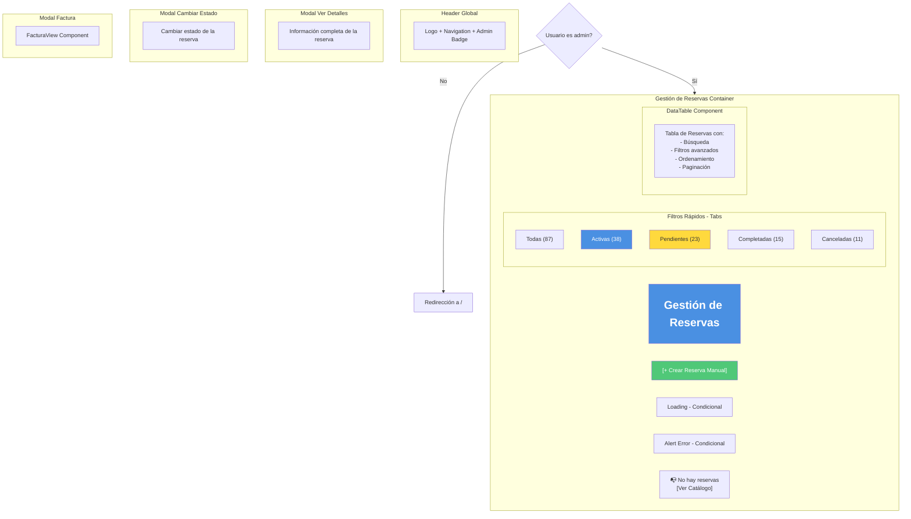
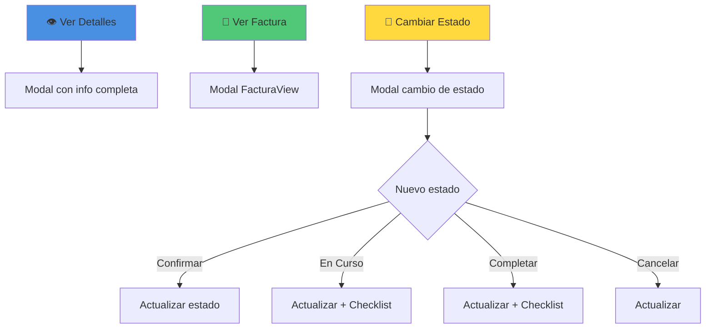
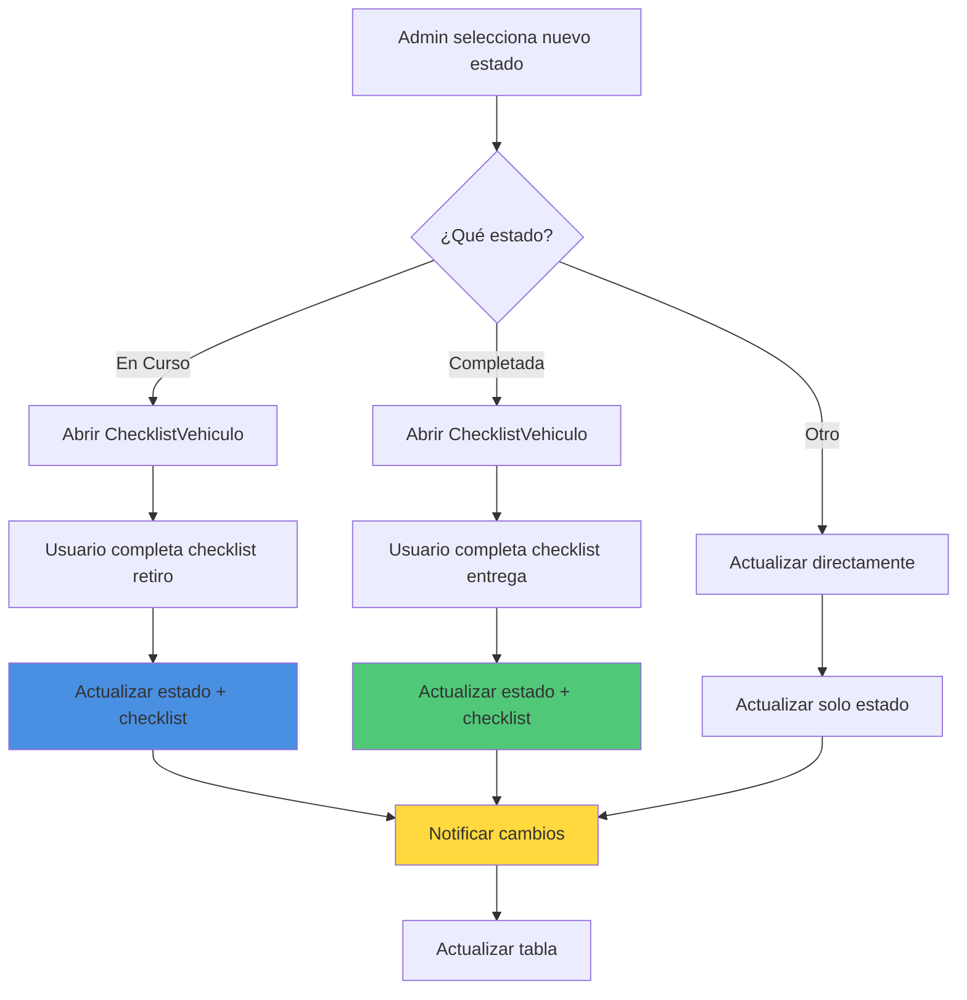

# 📋 Wireframe: Gestión de Reservas (Admin)

**Ruta:** `/dashboard/reservas`  
**Archivo:** `rentacar/front/files/src/app/dashboard/reservas/page.js`  
**Acceso:** Solo administradores

## 📐 Estructura Visual



## 📊 DataTable de Reservas

### Estructura de la Tabla

| Columna | Tipo | Ordenable | Filtrable |
|---------|------|-----------|-----------|
| ID | number | ✅ | ✅ |
| Cliente | text | ✅ | ✅ |
| Vehículo | text | ✅ | ✅ |
| Fecha Inicio | date | ✅ | ✅ |
| Fecha Fin | date | ✅ | ✅ |
| Días | number | ✅ | ❌ |
| Total | currency | ✅ | ❌ |
| Estado | badge | ✅ | ✅ |
| Pago | text | ✅ | ✅ |
| Acciones | buttons | ❌ | ❌ |

### Vista de la Tabla
```
┌────────────────────────────────────────────────────────────────────────────────┐
│  Gestión de Reservas                              [+ Crear Reserva Manual]     │
├────────────────────────────────────────────────────────────────────────────────┤
│  [Todas] [Activas] [Pendientes] [Completadas] [Canceladas]                    │
├────────────────────────────────────────────────────────────────────────────────┤
│  🔍 Buscar: [____________]  [Estado▼] [Método Pago▼] [Fecha▼]                 │
├─────┬───────────┬──────────────┬───────────┬───────┬────────┬────────┬────────┤
│ ID  │ Cliente   │ Vehículo     │ Inicio    │ Días  │ Total  │ Estado │ Acc.   │
├─────┼───────────┼──────────────┼───────────┼───────┼────────┼────────┼────────┤
│#123 │Juan Pérez │Toyota Corolla│10/03/2026 │  5    │ $250   │🟢Confir│👁️📄🔄  │
│#124 │Ana López  │Honda Civic   │15/03/2026 │  3    │ $135   │🟡Pend. │👁️📄🔄  │
│#125 │Pedro Gómez│Ford Explorer │20/03/2026 │  7    │ $525   │🔵EnCur │👁️📄🔄  │
│#126 │María Silva│BMW X5        │25/03/2026 │  2    │ $240   │⚫Compl.│👁️📄    │
│#127 │Luis Torres│Chevy Spark   │28/03/2026 │  4    │ $140   │🔴Canc. │👁️📄    │
├─────┴───────────┴──────────────┴───────────┴───────┴────────┴────────┴────────┤
│                        ← 1 2 3 4 5 →  Mostrando 1-10 de 87                    │
└────────────────────────────────────────────────────────────────────────────────┘
```

## 🏷️ Estados de Reserva con Badges

| Estado | Badge | Color | Descripción |
|--------|-------|-------|-------------|
| pendiente | 🟡 Pendiente | Amarillo | Esperando confirmación |
| confirmada | 🟢 Confirmada | Verde | Pago confirmado |
| en_curso | 🔵 En Curso | Azul | Vehículo retirado |
| completada | ⚫ Completada | Gris | Vehículo devuelto |
| cancelada | 🔴 Cancelada | Rojo | Reserva cancelada |

## 🎯 Botones de Acción por Fila



## 📝 Modal de Ver Detalles

```
┌─────────────────────────────────────────┐
│  ✕  Detalles de Reserva #12345          │
├─────────────────────────────────────────┤
│                                         │
│  📊 Estado Actual                       │
│  ────────────────────────────           │
│  🟢 Confirmada                          │
│                                         │
│  👤 Información del Cliente             │
│  ────────────────────────────           │
│  Nombre: Juan Pérez                     │
│  Email: juan@example.com                │
│  Teléfono: +54 11 1234-5678             │
│  Documento: DNI 12345678                │
│                                         │
│  🚗 Información del Vehículo            │
│  ────────────────────────────           │
│  [Imagen]                               │
│  Toyota Corolla 2023                    │
│  Matrícula: ABC-123                     │
│  Tipo: Sedan                            │
│                                         │
│  📅 Fechas de la Reserva                │
│  ────────────────────────────           │
│  Inicio: Lunes, 10 de marzo 2026        │
│           10:00 AM                      │
│  Fin:    Sábado, 15 de marzo 2026       │
│           10:00 AM                      │
│  Duración: 5 días                       │
│                                         │
│  💰 Información de Pago                 │
│  ────────────────────────────           │
│  Método: Mercado Pago                   │
│  Precio por día: $50.00                 │
│  Total días: 5                          │
│  ═══════════════════════════            │
│  TOTAL: $250.00                         │
│                                         │
│  📄 Documentos                          │
│  ────────────────────────────           │
│  ✅ Pasaporte verificado                │
│  ✅ Licencia verificada                 │
│  ✅ Comprobante de pago                 │
│                                         │
│  📜 Historial                           │
│  ────────────────────────────           │
│  ✅ Creada: 09/03/2026 10:30            │
│  ✅ Confirmada: 09/03/2026 10:35        │
│  ⏳ Pendiente: Retiro del vehículo      │
│                                         │
│  [Ver Factura] [Cambiar Estado] [Cerrar]│
└─────────────────────────────────────────┘
```

## 🔄 Modal de Cambiar Estado

```
┌─────────────────────────────────────┐
│  ✕  Cambiar Estado - Reserva #12345 │
├─────────────────────────────────────┤
│                                     │
│  Estado Actual: 🟢 Confirmada       │
│                                     │
│  Cambiar a:                         │
│  ────────────────────────           │
│                                     │
│  ⚪ 🟡 Pendiente                    │
│  ⚪ 🟢 Confirmada (actual)          │
│  ⚪ 🔵 En Curso                     │
│  ⚪ ⚫ Completada                    │
│  ⚪ 🔴 Cancelada                    │
│                                     │
│  Notas (opcional):                  │
│  ┌─────────────────────────────┐    │
│  │                             │    │
│  │                             │    │
│  └─────────────────────────────┘    │
│                                     │
│  ⚠️ Importante:                     │
│  • Al marcar "En Curso" se          │
│    solicitará checklist de retiro   │
│  • Al marcar "Completada" se        │
│    solicitará checklist de entrega  │
│                                     │
│  [Actualizar Estado] [Cancelar]     │
└─────────────────────────────────────┘
```

## 🔄 Flujo de Cambio de Estado



## 📊 Estados de la Página

### Estado 1: Loading
```
┌─────────────────────────┐
│ Gestión de Reservas     │
│                         │
│  ⏳ Cargando            │
│  reservas...            │
│                         │
└─────────────────────────┘
```

### Estado 2: Con Datos
```
┌────────────────────────────────────────┐
│ Gestión de Reservas  [+ Crear Manual]  │
├────────────────────────────────────────┤
│ [Todas] [Activas] [Pendientes]...      │
├────────────────────────────────────────┤
│ 🔍 [Buscar] [Filtros]                  │
├────────────────────────────────────────┤
│ [Tabla con 87 reservas]                │
│ [Paginación]                           │
└────────────────────────────────────────┘
```

### Estado 3: Sin Reservas
```
┌────────────────────────────────────────┐
│ Gestión de Reservas  [+ Crear Manual]  │
├────────────────────────────────────────┤
│ [Todas (0)] [Activas (0)]...           │
├────────────────────────────────────────┤
│                                        │
│  📭 No hay reservas todavía            │
│                                        │
│  Espera a que los clientes             │
│  comiencen a reservar vehículos        │
│                                        │
│  [Ver Catálogo]                        │
└────────────────────────────────────────┘
```

### Estado 4: Filtrado (ej: Solo Activas)
```
┌────────────────────────────────────────┐
│ Gestión de Reservas                    │
├────────────────────────────────────────┤
│ [Todas] [ACTIVAS] [Pendientes]...      │
├────────────────────────────────────────┤
│ Mostrando 38 reservas activas          │
│                                        │
│ [Tabla filtrada]                       │
│                                        │
│ [Limpiar Filtros]                      │
└────────────────────────────────────────┘
```

## 📱 Layout Responsivo

### Desktop
```
┌────────────────────────────────────────────┐
│  Gestión de Reservas    [+ Crear Manual]   │
├────────────────────────────────────────────┤
│  [Todas] [Activas] [Pend.] [Compl.] [Canc]│
├────────────────────────────────────────────┤
│  🔍 [_______]  [Estado▼] [Pago▼] [Fecha▼] │
├────────────────────────────────────────────┤
│  ID  Cliente  Vehículo  Inicio  $ Estado   │
│  [Todas las columnas visibles]             │
│  [Paginación completa]                     │
└────────────────────────────────────────────┘
```

### Tablet
```
┌──────────────────────────┐
│ Reservas  [+ Crear]      │
├──────────────────────────┤
│ [Tabs de Estado]         │
├──────────────────────────┤
│ [Búsqueda y filtros]     │
├──────────────────────────┤
│ ID  Cliente  Vehículo    │
│ Inicio  Total  Estado    │
│ [Columnas reducidas]     │
└──────────────────────────┘
```

### Mobile
```
┌──────────────┐
│ Reservas     │
│ [+ Crear]    │
├──────────────┤
│ [Tabs]       │
│ 🔍 [____]    │
├──────────────┤
│ ┌──────────┐ │
│ │ #123     │ │
│ │ Juan P.  │ │
│ │ Corolla  │ │
│ │ $250     │ │
│ │ 🟢Confir │ │
│ │ [👁️📄🔄]│ │
│ └──────────┘ │
│ ┌──────────┐ │
│ │ [Card 2] │ │
│ └──────────┘ │
└──────────────┘
```

## 📊 Estadísticas de Tabs

```javascript
// Contador dinámico por estado
{
  todas: 87,
  activas: 38,        // confirmada + en_curso
  pendientes: 23,     // pendiente
  completadas: 15,    // completada
  canceladas: 11      // cancelada
}
```

## 🔍 Filtros Avanzados

### Panel de Filtros
```
┌─────────────────────────────────┐
│  Filtros Avanzados              │
├─────────────────────────────────┤
│  Estado:                        │
│  ☑ Todas                        │
│  ☐ Pendiente                    │
│  ☐ Confirmada                   │
│  ☐ En Curso                     │
│  ☐ Completada                   │
│  ☐ Cancelada                    │
│                                 │
│  Método de Pago:                │
│  ☑ Todos                        │
│  ☐ Mercado Pago                 │
│  ☐ Tarjeta                      │
│  ☐ Transferencia                │
│  ☐ Efectivo                     │
│                                 │
│  Rango de Fechas:               │
│  Desde: [10/03/2026]            │
│  Hasta: [31/03/2026]            │
│                                 │
│  Vehículo:                      │
│  [Buscar vehículo...]           │
│                                 │
│  Cliente:                       │
│  [Buscar cliente...]            │
│                                 │
│  [Aplicar] [Limpiar]            │
└─────────────────────────────────┘
```

## 💡 Funcionalidades Especiales

### 1. Búsqueda Inteligente
```javascript
// Busca en múltiples campos
busqueda en: [
  'id',
  'cliente.nombre',
  'cliente.email',
  'auto.marca',
  'auto.modelo',
  'auto.matricula',
  'metodoPago'
]
```

### 2. Exportar Datos
```
[+ Crear Manual] [📊 Exportar CSV] [📄 Exportar PDF]
```

### 3. Vista de Calendario (Opcional)
```
┌──────────────────────────────┐
│  Cambiar a Vista Calendario  │
└──────────────────────────────┘

┌─────────────────────────────────────┐
│  Marzo 2026                         │
├─────┬─────┬─────┬─────┬─────┬──────┤
│ L   │ M   │ M   │ J   │ V   │ S/D  │
├─────┼─────┼─────┼─────┼─────┼──────┤
│ 10  │ 11  │ 12  │ 13  │ 14  │ 15/16│
│ 🟢  │ 🟢  │ 🟢  │ 🟢  │ 🟢  │      │
│ #123│     │     │     │     │      │
└─────┴─────┴─────┴─────┴─────┴──────┘
```

## 💾 Persistencia y Sincronización

### Eventos de Actualización
```javascript
// Al cambiar estado de reserva
notifyDataChange();

// Actualizar dashboard stats
window.dispatchEvent(new CustomEvent('rentacarDataUpdate', {
  detail: { type: 'reservas', action: 'statusChange' }
}));

// Actualizar disponibilidad de vehículos
updateVehicleAvailability(reserva.autoId);
```

## 🔗 Características Especiales

1. **Tabs por estado:** Filtrado rápido
2. **Búsqueda multi-campo:** Encuentra por cualquier dato
3. **Filtros avanzados:** Estado, pago, fechas, vehículo, cliente
4. **Cambio de estado:** Con checklist integrado
5. **Vista de factura:** Modal integrado
6. **Exportación:** CSV/PDF de reservas
7. **Estadísticas en tiempo real:** Contadores actualizados
8. **Ordenamiento:** Por cualquier columna
9. **Paginación:** Manejo de muchas reservas
10. **Responsive:** Mobile-friendly
11. **Códigos de color:** Estados visualmente claros
12. **Historial:** Timeline de cada reserva
