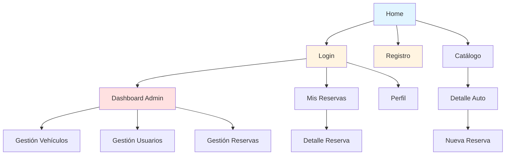

# 📐 Wireframes del Sistema RentaCar

Este directorio contiene los wireframes de todas las páginas del sistema RentaCar, generados automáticamente mediante análisis del código existente.

## �️ Mapa de Navegación

👉 **[Ver Mapa Completo de Navegación](./00-navegacion.md)** - Flujos, jerarquía y rutas del sistema

## �📋 Índice de Páginas

### 🌐 Páginas Públicas
1. [**Home (Landing Page)**](./01-home.md) - Página principal del sitio
2. [**Login**](./02-login.md) - Inicio de sesión
3. [**Registro**](./03-register.md) - Registro de nuevos usuarios
4. [**Catálogo**](./04-catalogo.md) - Listado de vehículos disponibles
5. [**Detalle de Auto**](./05-auto-detalle.md) - Información detallada de un vehículo

### 🔐 Páginas de Usuario Autenticado
6. [**Mis Reservas**](./06-reservas.md) - Listado de reservas del usuario
7. [**Nueva Reserva**](./07-nueva-reserva.md) - Formulario para crear una reserva
8. [**Detalle de Reserva**](./08-reserva-detalle.md) - Detalles y factura de una reserva
9. [**Perfil**](./09-perfil.md) - Gestión del perfil de usuario

### 👨‍💼 Panel de Administración
10. [**Dashboard Principal**](./10-dashboard.md) - Panel principal del administrador
11. [**Gestión de Vehículos**](./11-dashboard-vehiculos.md) - CRUD de vehículos
12. [**Gestión de Usuarios**](./12-dashboard-usuarios.md) - Administración de usuarios
13. [**Gestión de Reservas**](./13-dashboard-reservas.md) - Administración de reservas

## 🎨 Formato de los Wireframes

Todos los wireframes están creados en formato **Mermaid**, que permite:
- ✅ Visualización directa en VS Code
- ✅ Renderizado automático en GitHub
- ✅ Fácil edición y mantenimiento
- ✅ Diagramas claros y profesionales

## 🔄 Flujo de Navegación

## 📝 Convenciones

- **Colores en los diagramas:**
  - 🔵 Azul: Elemento principal/destacado
  - 🟢 Verde: Acciones positivas (guardar, confirmar)
  - 🔴 Rojo: Acciones críticas (eliminar, cancelar)
  - 🟡 Amarillo: Alertas o información importante

## 📅 Última Actualización

**Fecha:** 10 de Marzo, 2026  
**Generado por:** Análisis automático del código fuente
